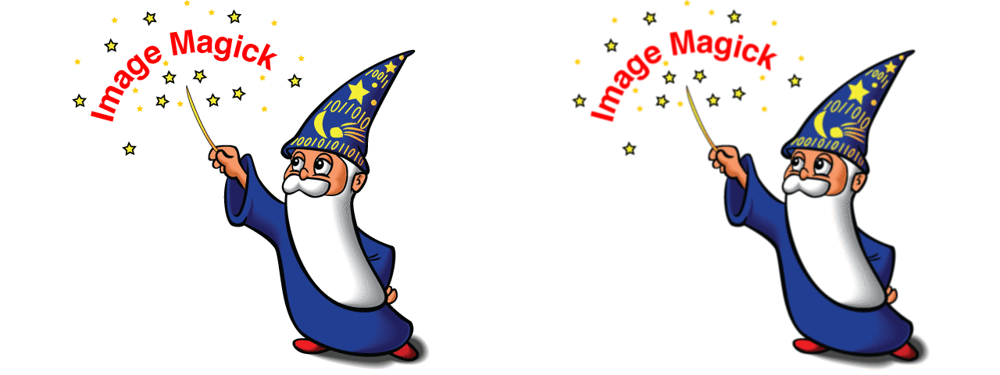
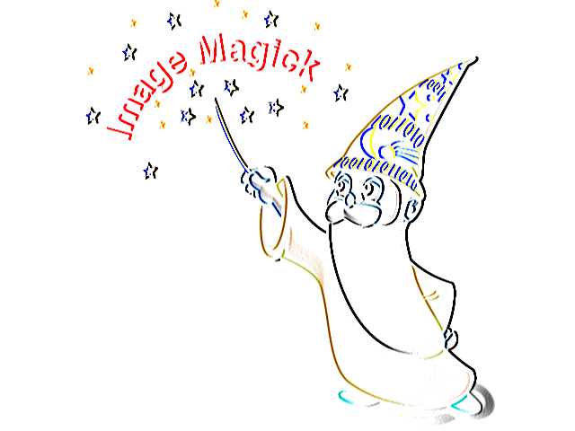
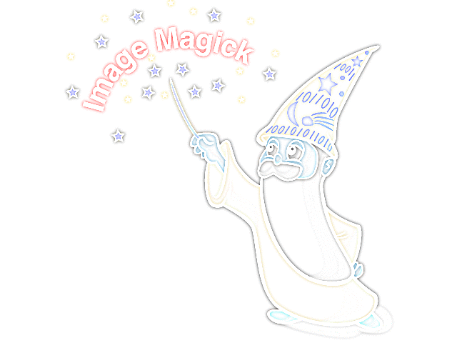
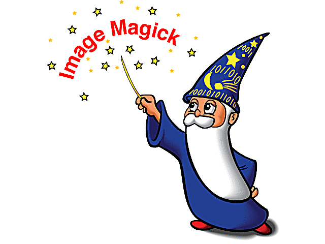

Release 1.4 of the [magick package](https://cran.r-project.org/web/packages/magick/vignettes/intro.html) introduces
a new feature called [image convolution](https://en.wikipedia.org/wiki/Kernel_(image_processing)#Convolution) that
was requested by Thomas L. Pedersen. In this post we explain what this is all about.

## Kernel Matrix

The new `image_convolve()` function applies a [kernel](https://en.wikipedia.org/wiki/Kernel_(image_processing)) over the image. Kernel convolution means that each pixel value is recalculated using the *weighted neighborhood sum* defined in the kernel matrix. For example lets look at this simple kernel:

```r
library(magick)

kern <- matrix(0, ncol = 3, nrow = 3)
kern[1, 2] <- 0.25
kern[2, c(1, 3)] <- 0.25
kern[3, 2] <- 0.25
kern
##      [,1] [,2] [,3]
## [1,] 0.00 0.25 0.00
## [2,] 0.25 0.00 0.25
## [3,] 0.00 0.25 0.00
```

This kernel changes each pixel to the mean of its horizontal and vertical neighboring pixels, which results in a slight blurring effect in the right-hand image below:

```r
img <- image_read('logo:')
img_blurred <- image_convolve(img, kern)
image_append(c(img, img_blurred))
```



## Standard Kernels

Many operations in `magick`  such as blurring, sharpening, and edge detection are
actually special cases of image convolution. The benefit of explicitly using
`image_convolve()` is more control. For example, we can blur an image and then blend
it together with the original image in one step by mixing a blurring kernel with the
unit kernel:

```r
img %>% image_convolve('Gaussian:0x5', scaling = '60,40%')
```


The above requires a bit of explanation. ImageMagick defines several common
[standard kernels](https://www.imagemagick.org/Usage/convolve/) such as the
gaussian kernel. Most of the standard kernels take one or more parameters,
e.g. the example above used a gaussian kernel with 0 *radius* and 5 *sigma*.

In addition, `scaling` argument defines the magnitude of the kernel, and possibly
how much of the original picture should be mixed in. Here we mix 60% of the
blurring with 40% of the original picture in order to get a diffused lightning effect.

## Edge Detection

Another area where kernels are of use is in edge detection. A simple example of
a direction-aware edge detection kernel is the [*Sobel*](https://en.wikipedia.org/wiki/Sobel_operator) kernel.
As can be seen below, vertical edges are detected while horizontals are not.

```r
img %>% image_convolve('Sobel') %>% image_negate()
```



Something less apparent is that the result of the edge detection is truncated.
Edge detection kernels can result in negative color values which get truncated to zero.
To combat this it is possible to add a `bias` to the result. Often you'll end up with
scaling the kernel to 50% and adding 50% bias to move the midpoint of the result to 50%
grey:

```r
img %>% image_convolve('Sobel', scaling = '50%', bias = '50%')
```


## Sharpening

ImageMagick has many more edge detection kernels, some of which are insensitive to
the direction of the edge. To emulate a classic high-pass filter from photoshop use
[difference of gaussians](https://en.wikipedia.org/wiki/Difference_of_Gaussians) kernel:

```r
img %>% image_convolve('DoG:0,0,2') %>% image_negate()
```



As with the blurring, the original image can be blended in with the transformed one, effectively sharpening the image along edges.

```r
img %>% image_convolve('DoG:0,0,2', scaling = '100, 100%')
```



The [ImageMagick documentation](https://www.imagemagick.org/Usage/convolve/) has more examples of convolve with various avaiable kernels.
