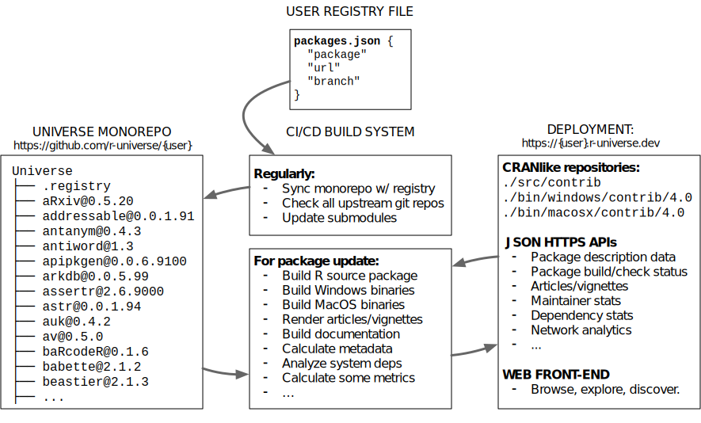
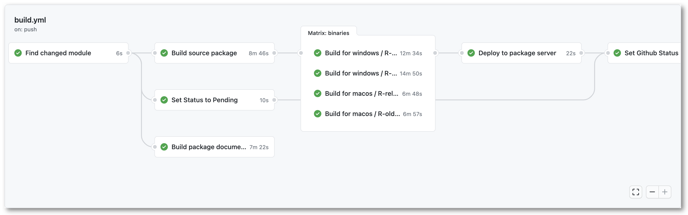

This post is part of a series of technotes about our new [r-universe](https://r-universe.dev) project. As the project evolves, we will be posting updates about new features and some technical details. This post globally introduces the core build system.

## The R-universe build system

R-universe is a relatively complex system, consisting of many moving pieces, which combine a range of front-end, back-end, and infrastructural features, on multiple platforms. A key challenge in developing such a system is managing overall complexity by finding ways to reduce the problem into smaller, loosely coupled components, which can be thought of, and developed, somewhat independently.

A lot of the early work into R-universe has gone into experimenting with designs to gradually build up such a system in a way that is robust and scalable, while keeping complexity under control. 

We have arrived at a design which distinguishes 3 core parts of the infrastructure:
 
 1. __Source monorepos__: Manage package repositories as monorepos with a central registry.
 2. __Extensible build system__: Plugable CI chain to build R package binaries, docs, and other things.
 3. __Deployment__: A high-performance "cranlike" package server with APIs for metadata and frontends.

Each of these pieces again consists of smaller tasks, but at the core, these pieces provide the essential groundwork for the R-universe infrastructure.



## Part 1: Package repositories as monorepos

The package monorepo is the first core idea of R-universe. Every package universe is generated from a registry file, which lists the packages and corresponding git repositories. The format is modeled after [rOpenSci's official package registry](http://ropensci.github.io/roregistry/packages.json) and consists of a simple JSON structure:

```json
[
  {
    "package": "taxize",
    "url": "https://github.com/ropensci/taxize",
    "branch": "master"
  },
  {
    "package": "rplos",
    "url": "https://github.com/ropensci/rplos",
    "branch": "master"
  },
...
```

The registry file may either be auto-generated or manually curated by the owner of a universe. From the registry file, the r-universe system generates a [monorepo](https://en.wikipedia.org/wiki/Monorepo), in which each R package is a submodule. The monorepo automatically gets updated with changes in the registry file or package repositories. All r-universe monorepos are tracked under `https://github.com/r-universe/{user}`, for example [r-universe/ropensci](https://github.com/r-universe/ropensci). 

The use of monorepos is popular in big software companies like Google and Facebook as a way to have a common state and history for the entire software suite as a whole. Our use is slightly different, because package authors do not commit directly to the monorepo, but instead we track upstream packages using submodules. But the purpose is the same: the monorepo provides a central place to track sources from the entire repository. It provides the exact state and history of packages and versions contained in the repository, simply using git.

Note that the packages do not need to be hosted on GitHub themselves: they may live on any public git server, e.g. Gitlab or a university self hosted git server. The only thing that matters is that the git server is public readable, so the package source code can be checked out when initiating the submodule.

## Part 2: An extensible CI/CD build system

Based on the sources from the monorepo, we arrive at the second part of the system: building all the things. Each package update in the monorepo triggers a series of actions to build the source tarball, binaries for Windows and MacOS, and documentation[^1], which all get deployed at the end of the run. Because everything is deployed simultaneously, the binary package versions are always in sync with the source package. This is different from CRAN where the binaries  appear a few days later.

The build process also performs some additional tasks, such as automatically analyzing if the package requires system dependencies, looking for a package logo, etc. We try to write the build system in a way that is extensible, such that we can easily add additional steps in the future. For example we plan to collect some statistics on the package commit history, extract citations, generate [codemeta](https://cran.r-project.org/web/packages/codemetar/vignettes/codemetar.html), and other things that were mentioned at [my talk at rstudio::global](https://rstudio.com/resources/rstudioglobal-2021/monitoring-health-and-impact-of-open-source-projects/).


[](https://github.com/r-universe/ropensci/actions/runs/608656990)

One major challenge in designing the build system is finding a balance between leveraging powerful CI platforms, while limiting vendor lock-in. The R-universe build scripts are mostly written to be portable and/or containerized, such that they could run on any server. But in practice we currently take advantage of [GitHub Actions](https://github.com/features/actions) (GHA) a lot, which provides unparalleled infrastructure and resources and is a great fit for our project.

An additional benefit of GitHub actions is that it supports setting up [self hosted runners](https://docs.github.com/en/actions/hosting-your-own-runners/about-self-hosted-runners) when we need more capacity than free resources provided by GitHub. Thereby we can always scale up by switching to our own build servers when needed, while still taking advantage of many nice features of the GHA platform. For now, this seems like a reasonable trade-off.

## Part 3: A high-performance package server

At the end of each CI run, all these binaries and metadata that are generated during the build process are deployed to the r-universe server. This brings us to the 3rd core piece of our infrastructure: the [cranlike package server](https://www.npmjs.com/package/cranlike). 

The package server consists of a NodeJS/MongoDB stack and is the most critical piece of the system. It is specifically developed for R-universe, but it is [open source](https://github.com/r-universe-org/cranlike-server) and could be used for other purposes as well. As the name implies, it implements the standard repository format, such that users can install packages (incl. Win/Mac binaries) exactly the same way as from CRAN (no Rtools/devtools/sysreqs required):

```r
# Enable this universe
options(repos = c(
    ropensci = 'https://ropensci.r-universe.dev',
    CRAN = 'https://cloud.r-project.org'))
install.packages('magick')
```

But unlike CRAN or similar systems, R-universe does not store the package repository as pre-generated static files. All R-universe repositories and indices are generated on demand from packages in the database for a given universe. 

The benefit of using a database is that it makes the system dynamic: we can interface with the repository data in other ways, serve hybrid/virtual package repositories, analyze the dependency network, etc. 
For example, the server exposes summary data about the universe from several `/stats/` APIs:

  - [`/stats/maintainers`](https://ropensci.r-universe.dev/stats/maintainers): all unique package maintainers
  - [`/stats/descriptions`](https://ropensci.r-universe.dev/stats/descriptions): description fields for all packages
  - [`/stats/vignettes`](https://ropensci.r-universe.dev/stats/vignettes): rmarkdown vignettes included with packages
  - [`/stats/sysdeps`](https://ropensci.r-universe.dev/stats/sysdeps): automatically derived system dependencies used by packages
  - [`/stats/checks`](https://ropensci.r-universe.dev/stats/checks?limit=10): most recent build/check runs

These same APIs are used in the [front-end](https://ropensci.r-universe.dev) webpages. All the stats APIs use the [ndjson](http://ndjson.org/) data format which you can read in R using jsonlite:

```r
# All rOpenSci package descriptions
ropensci <- jsonlite::stream_in(url('https://ropensci.r-universe.dev/stats/descriptions'))
View(ropensci)

# Compare with:
packages <- available.packages(repos = 'https://ropensci.r-universe.dev')
```

This illustrates how our package server not only makes it easy to host personal package repositories, but also unlocks data and metadata about the software, which can be used for all sorts of interfaces and other research applications.  


[^1]: Building pkgdown sites is currently only enabled for the rOpenSci universe, and deployed to our [docs server](https://docs.ropensci.org).
