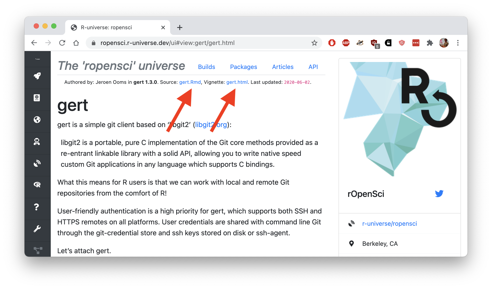

<small><em>This post is part of a series of technotes about [R-universe](https://r-universe.dev), a new umbrella project by rOpenSci under which we experiment with various new ideas for improving publication and discovery of research software in R.
As the project evolves, we will post updates to document features and technical details.
For more information, visit the [r-universe project page](/r-universe/).</em></small>

---

## Browsing articles on R-universe

In the past weeks we have extended the R-universe build system and front-ends with some new features for publishing *articles*. Articles can be used for documentation of R packages, but also for other purposes, such as reports, tutorials, papers, or research compendia.
Publishing of articles in R-universe is based on the R vignette system, and we may add support for other types of articles later on.

The _articles_ tab on a universe homepage lists all documents owned by that organization, sorted by date. For example, below are the feeds from some popular package authors:

 - [`https://ropensci.r-universe.dev/ui#articles`](https://ropensci.r-universe.dev/ui#articles)
 - [`https://tidyverse.r-universe.dev/ui#articles`](https://tidyverse.r-universe.dev/ui#articles)
 - [`https://thomasp85.r-universe.dev/ui#articles`](https://thomasp85.r-universe.dev/ui#articles)
 - [`https://r-spatial.r-universe.dev/ui#articles`](https://r-spatial.r-universe.dev/ui#articles)
 - [`https://r-lib.r-universe.dev/ui#articles`](https://r-lib.r-universe.dev/ui#articles)

Rmarkdown articles are rendered in a minimal theme, which is fast to load and gives a consistent style. 
When browsing articles from within the dashboard, the top of the page displays direct links to the input (e.g. rmd) and output (html/pdf) files of the vignette.



The same holds for any of the [other universes](https://r-universe.dev/organizations/). 
You can also link directly to a [particular article](https://ropensci.r-universe.dev/ui#view:stplanr/stplanr-od.html) from the dashboard, or view the global feed of [recently updated articles across all universes](https://r-universe.dev/articles/). 

The `/stats/vignettes` endpoint provides API access to vignette data, for example to read in R:

```r
# run this in R
vignettes <- jsonlite::stream_in(url('https://ropensci.r-universe.dev/stats/vignettes'))
View(vignettes)
```

The main purpose of these features is to increase the visibility and availability of these documents, and make the information more discoverable, while automatically keeping the content current.
We think that a feed of articles can be a great way for researchers to explore the R ecosystem and learn about packages and developments, and find interesting research software.

But there is also a secondary purpose. By giving anyone the capability to setup and control a personal package universe, we want to lower the barrier for publishing automatically generated articles, beyond just software documentation. I will elaborate a bit more on this idea below.

## Vignettes and research compendia

One of the most powerful and unique features of the R environment is the elaborate 'vignette' system.

Vignettes are documents in PDF or HTML format obtained from plain-text literate source files from which R knows how to extract R code and create output[^WRE] based on Knuth's [literate programming](https://en.wikipedia.org/wiki/Literate_programming) ideas. In many ways, a vignette is the ultimate format to publish a reproducible document, because the system combines several essential ingredients for practical replication of (scientific) report:

 1. The source document, written in a weaving language such as rmarkdown, which combines text and layout, interspersed with R code, from which the resulting article is automatically generated.
 2. The R package containing the vignette, which provides supporting programming functionality for the code in the vignette. The package format allows us to organize source code, declare dependencies on other software, and generally bundle the entire project into a standardized structure.
 3. Well established tooling to automatically build and reproduce such vignettes, on any machine, using only the provided package and declared dependencies.

Vignettes are mainly used for long-form documentation of CRAN packages, but they can be used for creating any sort of reproducible document. For example, some researchers already take advantage of the R packaging system to create [research compendia](https://www.jstor.org/stable/27594227?seq=1).
They show how the R package format [lends itself very well](https://peerj.com/preprints/3192/) as a generic container for reproducible research. Packages provide a well established structure for bundling code, data, metadata (authors, dependencies, licenses, etc) and a manuscript in a way that is easy to share and well understood by R users.

## Publishing in your own universe

During the current pilot, R-universe mostly serves existing CRAN packages. But soon we will start letting users add other packages to their universe, such that eventually anyone can have their personal space of R packages and articles.

The biggest difference with official archives like CRAN, is that in your own universe, there are no policies that restrict the sort of packages you may publish. You could add some experimental projects, or research compendium packages, or even packages that solely consist of a vignette containing a tutorial or writeup. As long as the package is available from git, the R-universe infrastructure will automatically build binaries and articles, every time you git-push changes.

We hope that the new article functionality can help to make R-universe a fun place for learning about R packages, but also extend its usefulness to exchange other types of R based research material.


[^WRE]: https://cran.r-project.org/doc/manuals/r-release/R-exts.html#Writing-package-vignettes