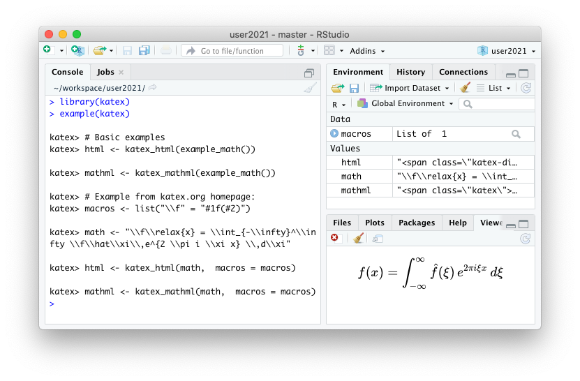

A new rOpenSci package [katex](https://cran.r-project.org/package=katex) is now on CRAN.
This package allows for converting latex math expressions to HTML and MathML for use in markdown documents or package documentation. 

The R package uses the [katex javascript library](https://katex.org/docs/api.html), but the rendering is done directly in R using the V8 engine (i.e. server-side), which eliminates the need for embedding the MathJax library into html pages.

## What it means to render server-side

To display a tex math in html we need a math typesetting library. The standard solution is to include [MathJax](https://www.mathjax.org/) with the html page, which attempts to convert math to html in the browser, upon loading of the webpage.
However MathJax is quite heavy, which slows down the page, and it may not work in browsers where use of JavaScript or external libraries is restricted.

An alternative solution is to perform the rendering when you generate the html page, and embed the pre-generated html snippet directly in the document. This makes the html file slightly larger, but the page loads much faster and is more robust because we do not need a complex dependency on the client. This is often called "server-side", because usually html is generated by a web server.

The new katex package provides server-side math rendering in R. It can be used to include math when generating html in R (e.g. via Rmarkdown or R package documentation) without having to include MathJax in the output html document.


## Tex math rendering in R

Functions [`katex_html()`](https://docs.ropensci.org/katex/reference/katex.html) and [`katex_mathml()`](https://docs.ropensci.org/katex/reference/katex.html) render a string with math to a html and mathml string. The html output has an option `preview` which will show a preview of the generated HTML snippet directly in a browser or the RStudio viewer. 


```r
# Basic example: render and show math html
library(katex)
math <- example_math()
html <- katex_html(math, preview = TRUE)

# Convert to mathml
mathml <- katex_mathml(math)
cat(mathml)
```


Note that by default, katex_html actually returns a mix of HTML for visual rendering and includes MathML for accessibility. The [katex docs](https://docs.ropensci.org/katex/reference/katex.html) site has more detailed information and additional options.
Hopefully this can be used to enable support for [server-side math in knitr/rmarkdown](https://github.com/rstudio/rmarkdown/pull/1940#issuecomment-875546179) soon!


## Embedding math in R documentation

The katex package also has a powerful helper function [`math_to_rd`](https://docs.ropensci.org/katex/reference/math_to_rd.html) to insert math into R documentation (`.rd`) files. This uses Katex rendering for R documentation rendered in html format, and the appropriate latex macros for documentation rendered in pdf or plain-text.


You can call this directly from within your roxygen2 or Rd files using the `\Sexpr` macro like this:

```r
\Sexpr[results=rd, stage=build]{
  katex::math_to_rd(katex::example_math())
}
```

<link rel="stylesheet" href="https://cdn.jsdelivr.net/npm/katex@0.13.11/dist/katex.min.css">
<span class="katex-display"><span class="katex"><span class="katex-mathml"><math xmlns="http://www.w3.org/1998/Math/MathML" display="block"><semantics><mrow><mi>f</mi><mo stretchy="false">(</mo><mi>x</mi><mo stretchy="false">)</mo><mo>=</mo><mfrac><mn>1</mn><mrow><mi>σ</mi><msqrt><mrow><mn>2</mn><mi>π</mi></mrow></msqrt></mrow></mfrac><msup><mi>e</mi><mrow><mo>−</mo><mfrac><mn>1</mn><mn>2</mn></mfrac><mo stretchy="false">(</mo><mfrac><mrow><mi>x</mi><mo>−</mo><mi>μ</mi></mrow><mi>σ</mi></mfrac><msup><mo stretchy="false">)</mo><mn>2</mn></msup></mrow></msup></mrow><annotation encoding="application/x-tex">f(x)= {\frac{1}{\sigma\sqrt{2\pi}}}e^{- {\frac {1}{2}} (\frac {x-\mu}{\sigma})^2}</annotation></semantics></math></span><span class="katex-html" aria-hidden="true"><span class="base"><span class="strut" style="height:1em;vertical-align:-0.25em;"></span><span class="mord mathnormal" style="margin-right:0.10764em;">f</span><span class="mopen">(</span><span class="mord mathnormal">x</span><span class="mclose">)</span><span class="mspace" style="margin-right:0.2777777777777778em;"></span><span class="mrel">=</span><span class="mspace" style="margin-right:0.2777777777777778em;"></span></span><span class="base"><span class="strut" style="height:2.25144em;vertical-align:-0.93em;"></span><span class="mord"><span class="mord"><span class="mopen nulldelimiter"></span><span class="mfrac"><span class="vlist-t vlist-t2"><span class="vlist-r"><span class="vlist" style="height:1.32144em;"><span style="top:-2.2027799999999997em;"><span class="pstrut" style="height:3em;"></span><span class="mord"><span class="mord mathnormal" style="margin-right:0.03588em;">σ</span><span class="mord sqrt"><span class="vlist-t vlist-t2"><span class="vlist-r"><span class="vlist" style="height:0.90722em;"><span class="svg-align" style="top:-3em;"><span class="pstrut" style="height:3em;"></span><span class="mord" style="padding-left:0.833em;"><span class="mord">2</span><span class="mord mathnormal" style="margin-right:0.03588em;">π</span></span></span><span style="top:-2.86722em;"><span class="pstrut" style="height:3em;"></span><span class="hide-tail" style="min-width:0.853em;height:1.08em;"><svg width='400em' height='1.08em' viewBox='0 0 400000 1080' preserveAspectRatio='xMinYMin slice'><path d='M95,702
c-2.7,0,-7.17,-2.7,-13.5,-8c-5.8,-5.3,-9.5,-10,-9.5,-14
c0,-2,0.3,-3.3,1,-4c1.3,-2.7,23.83,-20.7,67.5,-54
c44.2,-33.3,65.8,-50.3,66.5,-51c1.3,-1.3,3,-2,5,-2c4.7,0,8.7,3.3,12,10
s173,378,173,378c0.7,0,35.3,-71,104,-213c68.7,-142,137.5,-285,206.5,-429
c69,-144,104.5,-217.7,106.5,-221
l0 -0
c5.3,-9.3,12,-14,20,-14
H400000v40H845.2724
s-225.272,467,-225.272,467s-235,486,-235,486c-2.7,4.7,-9,7,-19,7
c-6,0,-10,-1,-12,-3s-194,-422,-194,-422s-65,47,-65,47z
M834 80h400000v40h-400000z'/></svg></span></span></span><span class="vlist-s">​</span></span><span class="vlist-r"><span class="vlist" style="height:0.13278em;"><span></span></span></span></span></span></span></span><span style="top:-3.23em;"><span class="pstrut" style="height:3em;"></span><span class="frac-line" style="border-bottom-width:0.04em;"></span></span><span style="top:-3.677em;"><span class="pstrut" style="height:3em;"></span><span class="mord"><span class="mord">1</span></span></span></span><span class="vlist-s">​</span></span><span class="vlist-r"><span class="vlist" style="height:0.93em;"><span></span></span></span></span></span><span class="mclose nulldelimiter"></span></span></span><span class="mord"><span class="mord mathnormal">e</span><span class="msupsub"><span class="vlist-t"><span class="vlist-r"><span class="vlist" style="height:1.0369199999999998em;"><span style="top:-3.4130000000000003em;margin-right:0.05em;"><span class="pstrut" style="height:3em;"></span><span class="sizing reset-size6 size3 mtight"><span class="mord mtight"><span class="mord mtight">−</span><span class="mord mtight"><span class="mord mtight"><span class="mopen nulldelimiter sizing reset-size3 size6"></span><span class="mfrac"><span class="vlist-t vlist-t2"><span class="vlist-r"><span class="vlist" style="height:0.8443142857142858em;"><span style="top:-2.656em;"><span class="pstrut" style="height:3em;"></span><span class="sizing reset-size3 size1 mtight"><span class="mord mtight"><span class="mord mtight">2</span></span></span></span><span style="top:-3.2255000000000003em;"><span class="pstrut" style="height:3em;"></span><span class="frac-line mtight" style="border-bottom-width:0.049em;"></span></span><span style="top:-3.384em;"><span class="pstrut" style="height:3em;"></span><span class="sizing reset-size3 size1 mtight"><span class="mord mtight"><span class="mord mtight">1</span></span></span></span></span><span class="vlist-s">​</span></span><span class="vlist-r"><span class="vlist" style="height:0.344em;"><span></span></span></span></span></span><span class="mclose nulldelimiter sizing reset-size3 size6"></span></span></span><span class="mopen mtight">(</span><span class="mord mtight"><span class="mopen nulldelimiter sizing reset-size3 size6"></span><span class="mfrac"><span class="vlist-t vlist-t2"><span class="vlist-r"><span class="vlist" style="height:0.87905em;"><span style="top:-2.656em;"><span class="pstrut" style="height:3em;"></span><span class="sizing reset-size3 size1 mtight"><span class="mord mtight"><span class="mord mathnormal mtight" style="margin-right:0.03588em;">σ</span></span></span></span><span style="top:-3.2255000000000003em;"><span class="pstrut" style="height:3em;"></span><span class="frac-line mtight" style="border-bottom-width:0.049em;"></span></span><span style="top:-3.4623857142857144em;"><span class="pstrut" style="height:3em;"></span><span class="sizing reset-size3 size1 mtight"><span class="mord mtight"><span class="mord mathnormal mtight">x</span><span class="mbin mtight">−</span><span class="mord mathnormal mtight">μ</span></span></span></span></span><span class="vlist-s">​</span></span><span class="vlist-r"><span class="vlist" style="height:0.344em;"><span></span></span></span></span></span><span class="mclose nulldelimiter sizing reset-size3 size6"></span></span><span class="mclose mtight"><span class="mclose mtight">)</span><span class="msupsub"><span class="vlist-t"><span class="vlist-r"><span class="vlist" style="height:0.8913142857142857em;"><span style="top:-2.931em;margin-right:0.07142857142857144em;"><span class="pstrut" style="height:2.5em;"></span><span class="sizing reset-size3 size1 mtight"><span class="mord mtight">2</span></span></span></span></span></span></span></span></span></span></span></span></span></span></span></span></span></span></span></span>


Check out the `?math_to_rd` manual page in R or the [math_to_rd docs](https://docs.ropensci.org/katex/reference/math_to_rd.html) for live examples and more details.