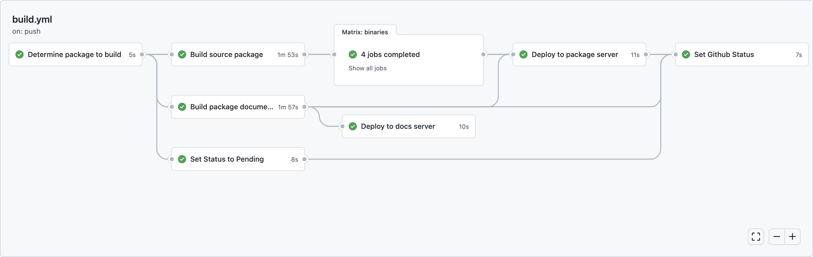
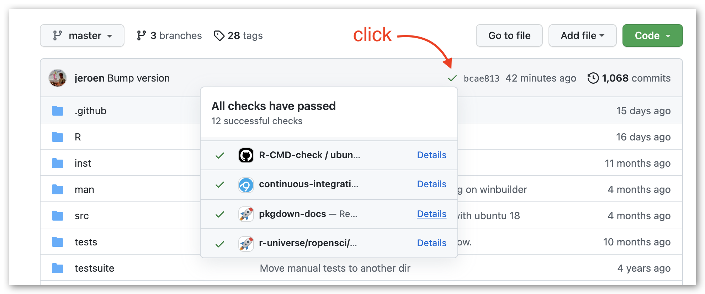
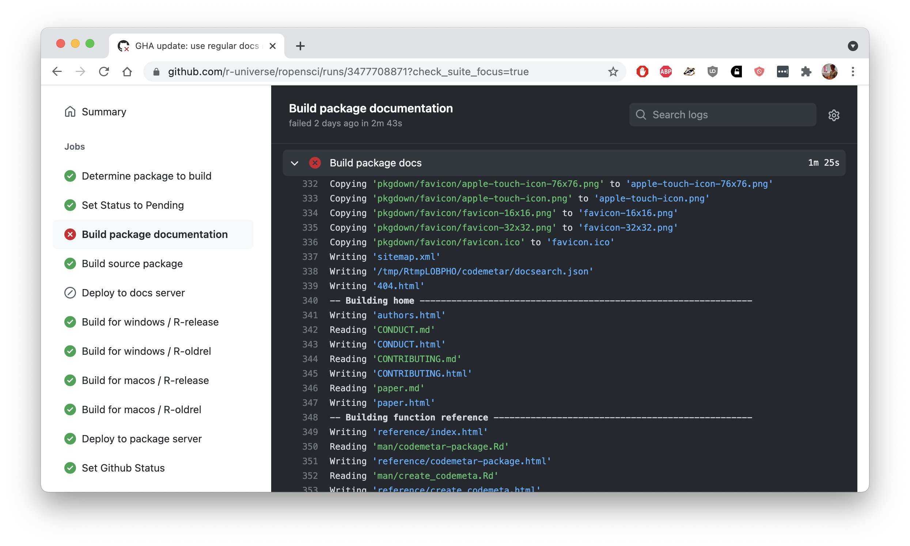

<small><em>This post is part of a series of technotes about [r-universe](https://r-universe.dev), a new umbrella project by rOpenSci under which we experiment with various ideas for improving publication and discovery of research software in R.
As the project evolves, we will post updates to document features and technical details.
For more information, visit the [r-universe project page](/r-universe/).</em></small>

---


__TLDR:__ As of today, the pkgdown sites for all rOpenSci packages on our [docs server](https://docs.ropensci.org/) are built on [r-universe](https://ropensci.r-universe.dev). This is an internal change; no action is required for package maintainers.


## From Jenkins to r-universe

For the past 2 years we have been using a [Jenkins server](/blog/2019/06/07/ropensci-docs/) to automatically build the pkgdown sites for all rOpenSci packages, which get published on https://docs.ropensci.org. By centralizing this process, we ensure that up-to-date documentation for all rOpenSci packages is available from a consistent URL with our personal branding, and without maintenance work for our package maintainers.

Jenkins has served us very well to get this off the ground, because it is highly configurable and makes it easy to manage continuous integration (CI) for hundreds of projects at once.

However Jenkins took quite some maintenance because it requires managing a private server, which needs configuration, backups, updates, etc. So we are happy to fold this task into [r-universe](https://ropensci.r-universe.dev/), such that the pkgdown sites for all rOpenSci packages are now built together with the binary packages and articles, in single system that runs on GitHub public infrastructure. 

## How it works

Building pkgdown documentation is now just another step in the r-universe [workflow](https://github.com/r-universe/ropensci/blob/master/.github/workflows/build.yml) which [automatically runs](https://ropensci.org/blog/2021/03/04/r-universe-buildsystem/) each hour for every package in rOpenSci that has updates in its default branch (master/main). When the build is successful, the pkgdown site is immediately deployed to our docs server.

[](https://github.com/r-universe/ropensci/actions/runs/1193900365)

After each build, the workflow sets the "commit status" (red/green check) in the package repository on the target commit. If the build failed, the 'details' link will directly take you to the build logs.



The [r-universe dashboard](https://ropensci.r-universe.dev/ui#builds) for also shows a new column called "docs" which indicates for all our packages if the pkgdown site was successfully built for the latest commit.

## Debugging failures

If your package documentation fails to build (e.g. due to a [bug in your vignettes](blog/2019/12/08/precompute-vignettes/)) you can inspect the pkgdown build logs on GitHub. Navigate to the workflow output either through the dashboard or the red cross in the package commit status, and click on "build package documentation".

[](https://github.com/r-universe/ropensci/runs/3477708871?check_suite_focus=true)

If this does not reveal the problem, you can replicate the entire build locally using the same [docker image](https://github.com/r-universe-org/build-docs) as used by our workflow. The container takes only one argument: the git url of an R package repository. For example to build the pkgdown site for the [pdftools](https://docs.ropensci.org/pdftools) package:

```sh
# Build docs for 'pdftools'
docker run runiverse/build-docs "https://github.com/ropensci/pdftools"
```

The [runiverse/build-docs](https://github.com/r-universe-org/build-docs) docker image has R and pkgdown preinstalled, and automatically installs other dependencies before building the pkgdown site. Alternatively, if you manually want to simulate the entire process outside of docker, you need the rodocs package:

```r
# Build pdftools documentation locally
remotes::install_github('r-universe-org/build-docs')
rodocs::build_site("https://github.com/ropensci/pdftools")
```

The rodocs package contains the plumbing code that automatically installs package dependencies and then calls `pkgdown::build_site()` using our custom rOpenSci pkgdown theme.

## What really changes

From the outside, the switch from Jenkins to r-universe does not change anything. Documentation for all rOpenSci packages will still be built and deployed automatically to https://docs.ropensci.org.

We hope that building our docs on r-universe will reduce complexity and maintenance work, and make the processes more transparent and easier to understand. There is now a single build workflow that generates package documentation, binaries and articles, and we can add more tasks to this list.

Everything runs on public GitHub infrastructure, so anyone can inspect the code that runs for each step in the workflow, and the sources of supporting R packages and docker images. And if the system works well for rOpenSci, we can try to support this functionality for other users and organizations in r-universe.

<script>
window.onload=function(){
    var img = $("img[src$='wf1.png']");
    img.mouseover(x => img.attr('src','wf2.png')).mouseout(x => img.attr('src','wf1.png'));
}
</script>
