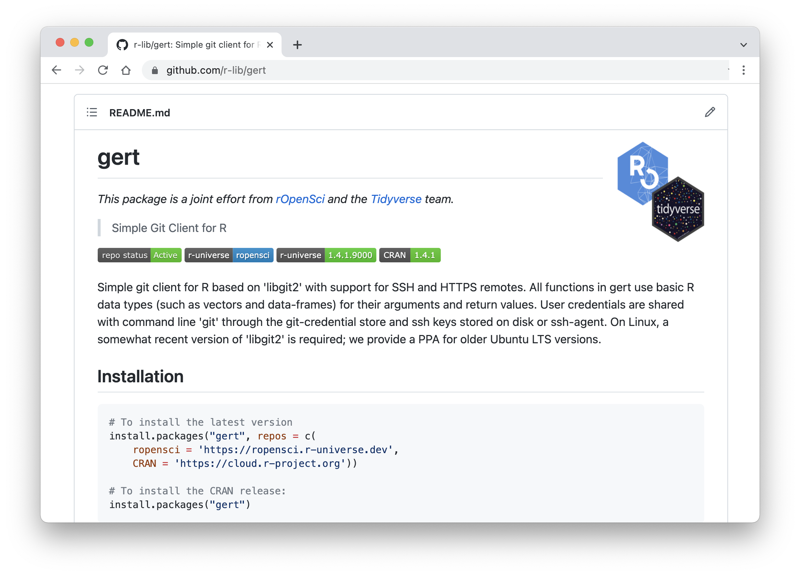

## Insignias en R-Universe

Después de [crear tu universo personal](/blog/2021/06/22/setup-runiverse/) el panel de control en `https://{yourname}.r-universe.dev` muestra la versión y otros detalles de cada paquete de tu repositorio. También hemos añadido una nueva [pestaña](https://ropensci.r-universe.dev/ui#badges) que muestra las insignias disponibles para el repositorio con sus URLs.



Las insignias son una buena forma de mostrar el estado de tu repositorio o de paquetes individuales en páginas web externas, como un archivo LÉAME, tu página de inicio o tus [personal](https://docs.github.com/en/account-and-profile/setting-up-and-managing-your-github-profile/customizing-your-profile/managing-your-profile-readme) u [organización](https://docs.github.com/en/organizations/collaborating-with-groups-in-organizations/customizing-your-organizations-profile) LÉEME del perfil en GitHub.

Actualmente hay dos tipos de insignias en r-universe: insignias de paquetes individuales que muestran la versión actual del paquete, e insignias globales (donde el punto final lleva el prefijo `:`) que muestran el nombre, el recuento y el estado de todo el repositorio.

## Insignias de la versión del paquete

En `/badges/{pkg}` proporciona un distintivo con la versión actual del paquete dado en el repositorio. Un lugar habitual para mostrar esta insignia es en el archivo README del paquete, junto con las instrucciones de instalación del paquete.

Si el paquete también está en CRAN, podrías colocarlo junto a una insignia de [r-pkg.org](https://docs.r-hub.io/#badges-for-cran-packages) para contrastarlo con la versión actual de CRAN y las instrucciones de instalación, por ejemplo, la página [LÉEME del paquete gert](https://github.com/r-lib/gert/blob/master/README.md):

```md


```

Que tiene el siguiente aspecto. Aquí los usuarios pueden ver inmediatamente en el README que el paquete está disponible en el universo rOpenSci, y que la versión de R-Universe es superior a la versión de CRAN.

[](https://github.com/r-lib/gert)

## Insignias de estado del repositorio

Además de las insignias para paquetes individuales, el sistema también proporciona algunas insignias con información sobre el estado de todo el repositorio de paquetes. Por ejemplo:

- `/badges/:name` el nombre del universo, es decir, tu nombre de usuario de github.
- `/badges/:total` el número total de paquetes del repositorio.
- `/badges/:registry` si la última actualización de monorepo se ha realizado correctamente, es decir, si tu registro de paquetes está bien.

La última insignia en particular puede serte muy útil ya que se pondrá en rojo cuando algo vaya mal en tu archivo de registro de paquetes. Esto suele significar que tu [packages.json](/blog/2021/06/22/setup-runiverse/#the-packagesjson-registry-file) puede hacer referencia a repositorios git o ramas que no existen, o que el sistema no encontró un paquete adecuado en la ubicación indicada.

Este es el aspecto de las insignias para el universo rOpenSci:

```md


```


## Personaliza el estilo de la insignia

Uno de los primeros usuarios de R-universe [solicitó](https://github.com/r-universe-org/help/issues/87) algunas opciones para personalizar el aspecto visual de las insignias. Hemos añadido 3 parámetros http a la API de las insignias:

- `scale` el tamaño de la insignia (donde 1 es el valor por defecto);
- `color` el color de la insignia;
- `style` ajústalo a "plano" para obtener insignias de estilo retro.

Por ejemplo: `https://ropensci.r-universe.dev/badges/:total?scale=2&color=pink&style=flat`


En [badgen](https://www.npmjs.com/package/badgen) contiene más detalles sobre estos parámetros. Nuestro [backend](https://github.com/r-universe-org/cranlike-server/blob/master/routes/badges.js) para esta API es bastante sencillo, intenta enviar una solicitud de ¿extracción? si tienes ideas para otras insignias útiles.


