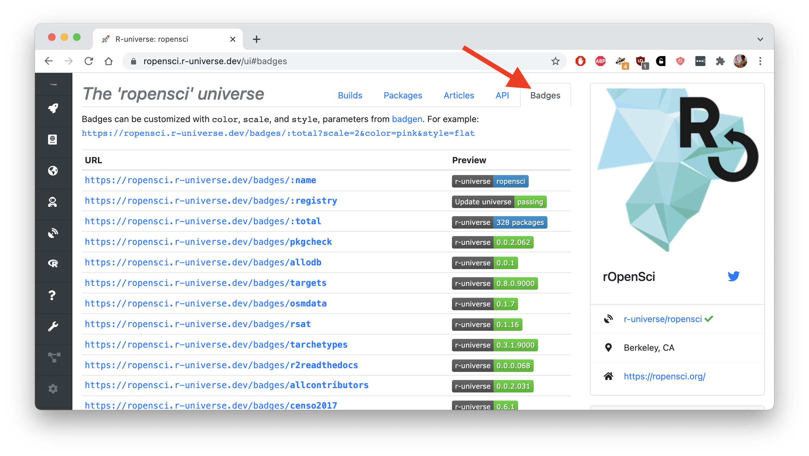
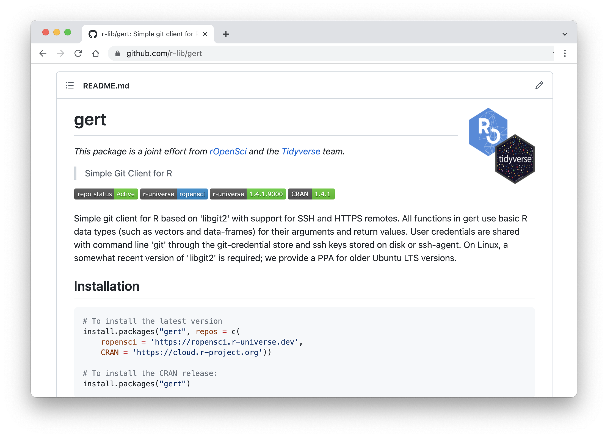

<small><em>This post is part of a series of technotes about [r-universe](https://r-universe.dev), a new umbrella project by rOpenSci under which we experiment with various ideas for improving publication and discovery of research software in R.
As the project evolves, we will post updates to document features and technical details.
For more information, visit the [r-universe project page](/r-universe/).</em></small>


## Badges in r-universe

After [creating your personal universe](/blog/2021/06/22/setup-runiverse/), the dashboard on `https://{yourname}.r-universe.dev` shows the version and other details for each package in your repository. We have also added a new tab that lists the available badges for the repository.

[](https://ropensci.r-universe.dev/ui#badges)

Badges provide a nice way to display the status of your repository or individual packages within external webpages, such as a README file, your homepage, or your [personal](https://docs.github.com/en/account-and-profile/setting-up-and-managing-your-github-profile/customizing-your-profile/managing-your-profile-readme) or [organization](https://docs.github.com/en/organizations/collaborating-with-groups-in-organizations/customizing-your-organizations-profile) profile README on GitHub. 

There are currently two types of badges in r-universe: individual package badges showing the current package version, and global badges (where the endpoint is prefixed with `:`) that show the name, count, and status of the entire repository.


## Package version badges

The `/badges/{pkg}` API yields a badge with the current version of the given package in the repository. A common place to display this badge is in the package README file, together with the package installation instructions.

If the package is also on CRAN, you could position it next to a badge from [r-pkg.org](https://docs.r-hub.io/#badges-for-cran-packages) to contrast it with the current CRAN version and installation instructions, see for example the [gert package README](https://github.com/r-lib/gert/blob/master/README.md):


```md


```

Which looks like below. Here users can immediately see from the README that the package is available from the ropensci universe, and that the version from r-universe is higher than the CRAN version.

[](https://github.com/r-lib/gert)

## Repository status badges

Besides badges for individual packages, the system also provides a few badges with information about the status of the entire package repository. For example:

 - `/badges/:name` the name of the universe, i.e. your github username 
 - `/badges/:total` the total number of packages in the repository
 - `/badges/:registry` if the latest monorepo update was successful, i.e. if your package registry is OK

The last badge in particular may be useful for yourself. If will go red when something is wrong with your package registry file. This usually means your [packages.json](/blog/2021/06/22/setup-runiverse/#the-packagesjson-registry-file) may reference git repositories or branches that do not exist, or the system did not find a proper package in the given location.

This is what the badges look like for the ropensci universe:


```md


```


## Customize the badge style

One of the early adopters of R-universe had [requested](https://github.com/r-universe-org/help/issues/87) some options to customize the visual appearance of the badges. We have added 3 http parameters to the badges API:

 - `scale` the size of the badge (where 1 is the default);
 - `color` the color of a badge;
 - `style` set to "flat" to get retro style badges.

For example: `https://ropensci.r-universe.dev/badges/:total?scale=2&color=pink&style=flat`


The [badgen](https://www.npmjs.com/package/badgen) docs show more details about these parameters. Our [backend](https://github.com/r-universe-org/cranlike-server/blob/master/routes/badges.js) for this API is fairly straight-forward, try sending a pull request if you have ideas for other useful badges.
