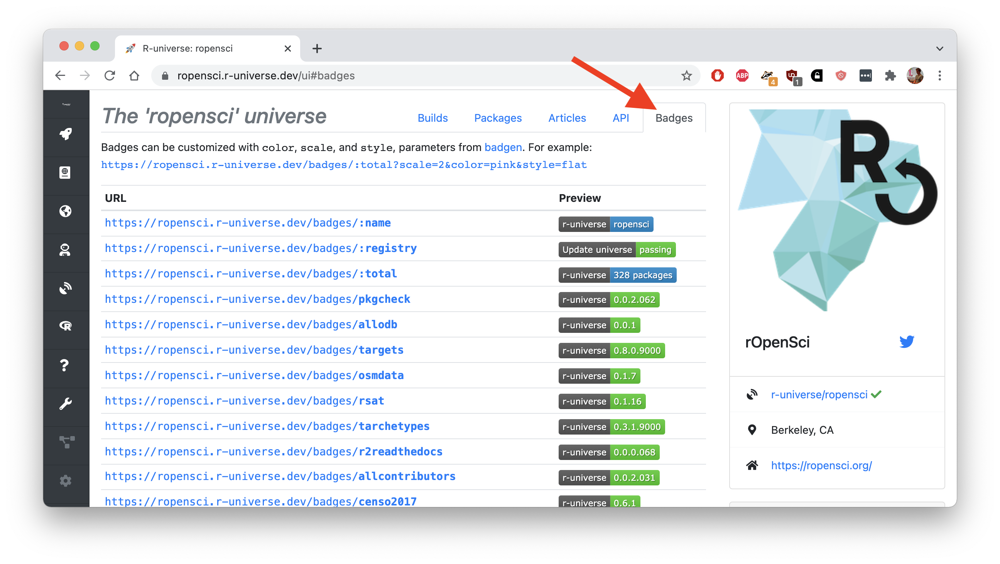

## Distintivos no r-universo

Depois de [criar o seu universo pessoal](/blog/2021/06/22/setup-runiverse/), o painel de controle em `https://{yourname}.r-universe.dev` mostra a versão e outros detalhes de cada pacote em seu repositório. Também adicionamos uma nova guia que lista os emblemas disponíveis para o repositório.

[](https://ropensci.r-universe.dev/ui#badges)

Os emblemas são uma boa maneira de exibir o status do seu repositório ou de pacotes individuais em páginas externas da Web, como um arquivo README, a sua página inicial ou o README do seu perfil [pessoal](https://docs.github.com/en/account-and-profile/setting-up-and-managing-your-github-profile/customizing-your-profile/managing-your-profile-readme) ou da [organização](https://docs.github.com/en/organizations/collaborating-with-groups-in-organizations/customizing-your-organizations-profile) no GitHub.

Atualmente, há dois tipos de emblemas no r-universe: emblemas de pacotes individuais que mostram a versão atual do pacote e emblemas globais (em que o ponto final é prefixado com `:`) que mostram o nome, a contagem e o status de todo o repositório.

## Selos de versão de pacote

Os `/badges/{pkg}` produzem um selo com a versão atual do pacote fornecido no repositório. Um local comum para exibir esse selo é no arquivo README do pacote, juntamente com as instruções de instalação do pacote.

Se o pacote também estiver no CRAN, você poderá posicioná-lo ao lado de um selo do [r-pkg.org](https://docs.r-hub.io/#badges-for-cran-packages) para contrastá-lo com a versão atual do CRAN e com as instruções de instalação, consulte, por exemplo, a seção [LEIAME do pacote gert](https://github.com/r-lib/gert/blob/master/README.md):

```md


```

Que tem a aparência abaixo. Aqui as pessoas usuárias podem ver imediatamente no README que o pacote está disponível na ropensci universe e que a versão do r-universe é superior à versão do CRAN.

[](https://github.com/r-lib/gert)

## Emblemas de status do repositório

Além de emblemas para pacotes individuais, o sistema também fornece alguns emblemas com informações sobre o status de todo o repositório de pacotes. Por exemplo:

- `/badges/:name` o nome do universo, ou seja, o seu nome de usuário(a) do github
- `/badges/:total` o número total de pacotes no repositório
- `/badges/:registry` se a última atualização do monorepo foi bem-sucedida, ou seja, se o seu registro de pacotes está OK

O último emblema, em particular, pode ser útil para você. Ele ficará vermelho quando houver algo errado com o arquivo de registro de pacotes. Isso geralmente significa que seu [packages.json](/blog/2021/06/22/setup-runiverse/#the-packagesjson-registry-file) pode fazer referência a repositórios ou ramificações do git que não existem, ou o sistema não encontrou um pacote adequado no local fornecido.

Esta é a aparência dos emblemas do universo ropensci:

```md


```


## Personalize o estilo do emblema

Um dos primeiros usuários do R-universe tinha [solicitado](https://github.com/r-universe-org/help/issues/87) algumas opções para personalizar a aparência visual dos emblemas. Adicionamos 3 parâmetros http à API dos emblemas:

- `scale` o tamanho do emblema (sendo 1 o padrão);
- `color` a cor de um emblema;
- `style` defina como "flat" para obter emblemas de estilo retrô.

Por exemplo: `https://ropensci.r-universe.dev/badges/:total?scale=2&color=pink&style=flat`


O emblema [badgen](https://www.npmjs.com/package/badgen) mostra mais detalhes sobre esses parâmetros. Nossos [backend](https://github.com/r-universe-org/cranlike-server/blob/master/routes/badges.js) para essa API é bastante simples. Tente enviar uma solicitação pull se você tiver ideias para outros emblemas úteis.


