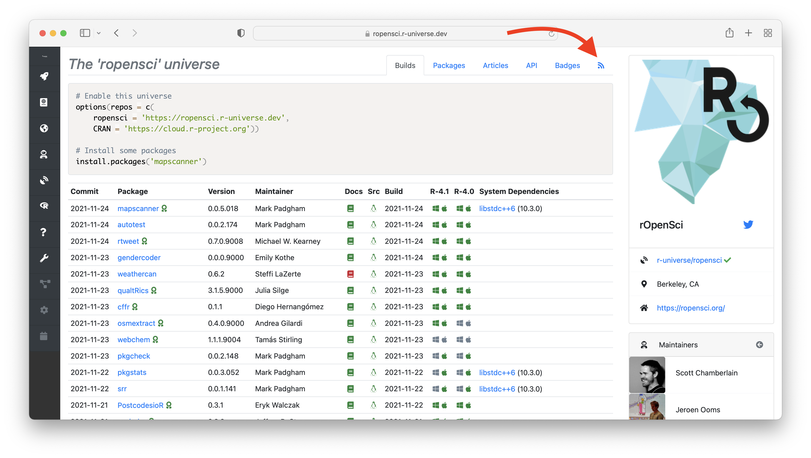

<small><em>This post is part of a series of technotes about [r-universe](https://r-universe.dev), a new umbrella project by rOpenSci under which we experiment with various ideas for improving publication and discovery of research software in R.
As the project evolves, we will post updates to document features and technical details.
For more information, visit the [r-universe project page](/r-universe/).</em></small>

## Continuous deployment in r-universe

A major difference between [r-universe](https://r-universe.dev) and static repositories like CRAN and BioConductor is continuous deployment: packages in r-universe are continuously built in CI and immediately deployed to our [package server](https://github.com/r-universe-org/cranlike-server/). This package server stores binaries and metadata in a database, which enables us to dynamically query and expose all the package data through APIs, dashboards, feeds, etc.



The package server also makes it relatively easy to add new functionality to expose information about R packages from the database in some other way. For example, we recently added a [badges API](/blog/2021/10/14/runiverse-badges/) to display package versions and totals in the form of a small badge image that can be embedded in webpages.

Based on suggestions from our early adopters, we have now added support for RSS feeds of package updates in a cran-like repository.

## Why RSS feeds in r-universe

Open science means that content is not locked in to some platform, but be made accessible in a variety of standard formats. Therefore all of the information that you can see in the r-universe dashboards, and much more, can also be retrieved through machine readable APIs.

The RSS format sadly lost popularity to social media platforms in recent years, but it is still the most widely used open standard for publishing feeds of regularly updated content. It actually seems to be making a bit of a [come-back](https://www.theverge.com/2021/5/20/22445284/google-rss-chrome-android-feature-test) with applications like Chrome and Slack now supporting it again.

This week we added experimental support of RSS feeds to the package server: the `/feed.xml` endpoint on any r-universe domain now gives an RSS feed of recent R package updates in the repository:

 - [`https://ropensci.r-universe.dev/feed.xml`](https://ropensci.r-universe.dev/feed.xml)
 - [`https://tidyverse.r-universe.dev/feed.xml`](https://tidyverse.r-universe.dev/feed.xml)
 - [`https://jeroen.r-universe.dev/feed.xml`](https://jeroen.r-universe.dev/feed.xml)

Each feed item contains the name and version of the updated R package, along with a timestamp and a link to the build log of the most recent commit. The feed also contains some additional metadata such as the package description, and a list of the articles (vignettes) contained in the package.

The dashboard for any universe also includes a link to this same URL, such that users can easily find and subscribe to your feed. 

There is also a global feed [`https://r-universe.dev/feed.xml`](https://r-universe.dev/feed.xml) which lists package updates across all universes, similarly to the [builds tab](https://r-universe.dev/builds/) on the website.

## Example: Slack integration

What would you use an RSS feed for in 2021? For example, if you use Slack, you can install the [Slack RSS app](https://slack.com/help/articles/218688467-Add-RSS-feeds-to-Slack) to subscribe to any number of RSS feeds. Thereby you can get a notification when your packages, or those of your favorite maintainers, have been updated in r-universe.

Do you have suggestions for other RSS use cases, or completely different functionality that the package server should expose? Let us know in the comments or on twitter!
