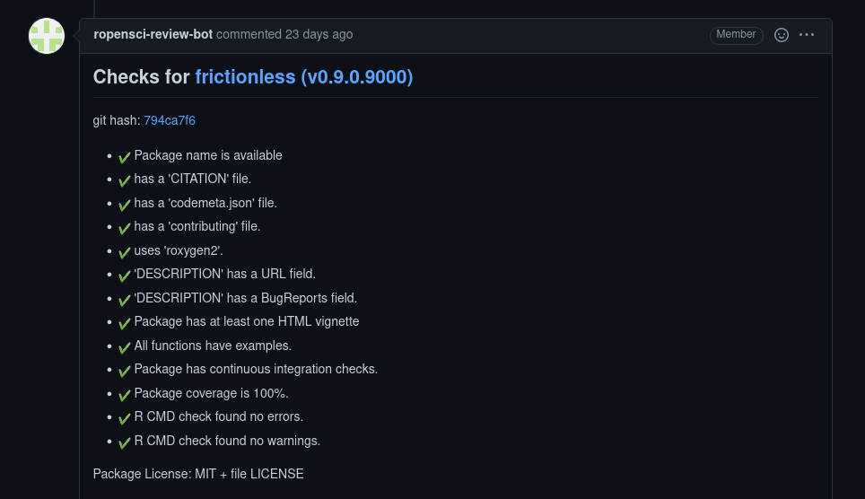

## What is pkgcheck?

The [{pkgcheck} package](https://github.com/ropensci-review-tools/pkgcheck) has
been developed by rOpenSci to automate the process of checking all packages on
submission. The `ropensci-review-bot` automatically runs {pkgcheck} on all submissions, and checks can also be called at any time by editors using the command:

```r
@ropensci-review-bot check package
```

The bot will return a list of checks which should ideally look like this:



To be ready for peer review, {pkgcheck} should return a series of &#10004;,
indiciating successful checks, and there shouldn't be any &#10008; symbols,
which indicate failed checks. Anybody preparing a package to submit is
recommended to ["use
pkgcheck"](https://devguide.ropensci.org/authors-guide.html) to confirm that a
package is indeed ready to submit. Until now, this has only been possible
through locally [installing the package and running the `pkgcheck()`
command](https://devguide.ropensci.org/authors-guide.html). Local checks suffer
two important disadvantages:

1. Results may only be reproducible on a local system, rather than be generally reproducible; and
2. The checks run by {pkgcheck} include all checks run by [the {rcmdcheck} package](https://r-lib.github.io/rcmdcheck/) which may take quite some time to run.

Just like the [GitHub {rcmdcheck} action](https://github.com/r-lib/actions/blob/v2-branch/examples/check-standard.yaml) which can be easily installed with one of [the `use_github_action_check_...` functions from the `usethis` package](https://usethis.r-lib.org/reference/github_actions.html), {pkgcheck} now also has a GitHub action which overcomes both of these disadvantages through running remotely (on GitHub), and generating reproducible results.

## The GitHub {pkgcheck-action}

This post is the "official" release announcement of {pkgcheck-action}, a GitHub
action which enables checks to be run everytime code is pushed to GitHub. The
action was developed by one of us (Jacob), and can be found [on GitHub at
ropensci-review-tools/pkgcheck-action](https://github.com/ropensci-review-tools/pkgcheck-action).
The easiest way to use this action in your own repository is to install [the
{pkgcheck} package](https://docs.ropensci.org/pkgcheck/#installation), and run
[the `use_github_action_pkgcheck()`
function](https://docs.ropensci.org/pkgcheck/reference/use_github_action_pkgcheck.html).
That will place a new file in the `.github/workflows` directory of your package
called "pkgcheck.yaml", an example of which is shown on [the main REAMDE of the
{pkgcheck-action}
repository](https://github.com/ropensci-review-tools/pkgcheck-action#usage). The action consists of the single job expressed in the final lines:

```yaml
jobs:
  check:
    runs-on: ubuntu-latest
    steps:
      - uses: ropensci-review-tools/pkgcheck-action@main
```

There are several parameters also described in that main README, which can
either be passed as parameters to the `use_github_action_pkgcheck()` function,
or added to the YAML workflow file as also described in the README.

### Posting {pkgcheck} results to a GitHub issue

In addition to the workflow printing the full details returned by the main
{pkgcheck} function, the output of {pkgcheck} can also be posted to a GitHub
issue, where it will appear precisely like the example shown above. Once the
workflow has finished, you'll receive a notification, and be able to view the
check results (with a `summary-only` parameter determining whether only a
summary of results like shown above will be posted to the issue, or whether
full results will be posted which include the summary followed by quite a bit
more detail). The workflow will only succeed when all {pkgcheck} checks have been passed. You can also put a {pkgcheck} badge in your README by inserting a modified version of these lines:

```md
[](https://github.com/<org>/<repo>/actions?query=workflow%3Apkgcheck)
```

That badge will then indicate if you passed all checks or not:

[](https://github.com/hypertidy/geodist/actions?query=workflow%3Apkgcheck)

<svg xmlns="http://www.w3.org/2000/svg" width="128" height="20">
  <defs>
    <linearGradient id="workflow-fill" x1="50%" y1="0%" x2="50%" y2="100%">
      <stop stop-color="#444D56" offset="0%"></stop>
      <stop stop-color="#24292E" offset="100%"></stop>
    </linearGradient>
    <linearGradient id="state-fill" x1="50%" y1="0%" x2="50%" y2="100%">
      <stop stop-color="#34D058" offset="0%"></stop>
      <stop stop-color="#28A745" offset="100%"></stop>
    </linearGradient>
  </defs>
  <g fill="none" fill-rule="evenodd">
    <g font-family="&#39;DejaVu Sans&#39;,Verdana,Geneva,sans-serif" font-size="11">
      <path id="workflow-bg" d="M0,3 C0,1.3431 1.3552,0 3.02702703,0 L102,0 L102,20 L3.02702703,20 C1.3552,20 0,18.6569 0,17 L0,3 Z" fill="url(#workflow-fill)" fill-rule="nonzero"></path>
      <text fill="#010101" fill-opacity=".3">
        <tspan x="22.1981982" y="15">pkgcheck</tspan>
      </text>
      <text fill="#FFFFFF">
        <tspan x="22.1981982" y="14">pkgcheck</tspan>
      </text>
    </g>
    <g transform="translate(79)" font-family="&#39;DejaVu Sans&#39;,Verdana,Geneva,sans-serif" font-size="11">
      <path d="M0 0h46.939C48.629 0 50 1.343 50 3v14c0 1.657-1.37 3-3.061 3H0V0z" id="state-bg" fill="url(#state-fill)" fill-rule="nonzero"></path>
      <text fill="#010101" fill-opacity=".3">
        <tspan x="4" y="15">passing</tspan>
      </text>
      <text fill="#FFFFFF">
        <tspan x="4" y="14">passing</tspan>
      </text>
    </g>
    <path fill="#959DA5" d="M11 3c-3.868 0-7 3.132-7 7a6.996 6.996 0 0 0 4.786 6.641c.35.062.482-.148.482-.332 0-.166-.01-.718-.01-1.304-1.758.324-2.213-.429-2.353-.822-.079-.202-.42-.823-.717-.99-.245-.13-.595-.454-.01-.463.552-.009.946.508 1.077.718.63 1.058 1.636.76 2.039.577.061-.455.245-.761.446-.936-1.557-.175-3.185-.779-3.185-3.456 0-.762.271-1.392.718-1.882-.07-.175-.315-.892.07-1.855 0 0 .586-.183 1.925.718a6.5 6.5 0 0 1 1.75-.236 6.5 6.5 0 0 1 1.75.236c1.338-.91 1.925-.718 1.925-.718.385.963.14 1.68.07 1.855.446.49.717 1.112.717 1.882 0 2.686-1.636 3.28-3.194 3.456.254.219.473.639.473 1.295 0 .936-.009 1.689-.009 1.925 0 .184.131.402.481.332A7.011 7.011 0 0 0 18 10c0-3.867-3.133-7-7-7z"></path>
  </g>
</svg>

Should you find a bug or
https://github.com/ropensci-review-tools/pkgcheck-action/issues
