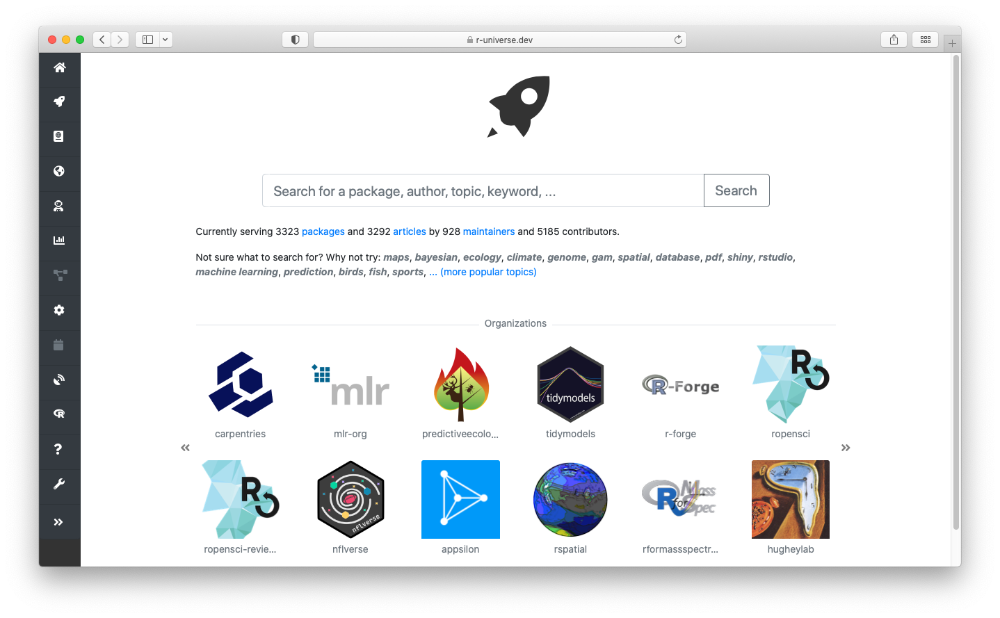
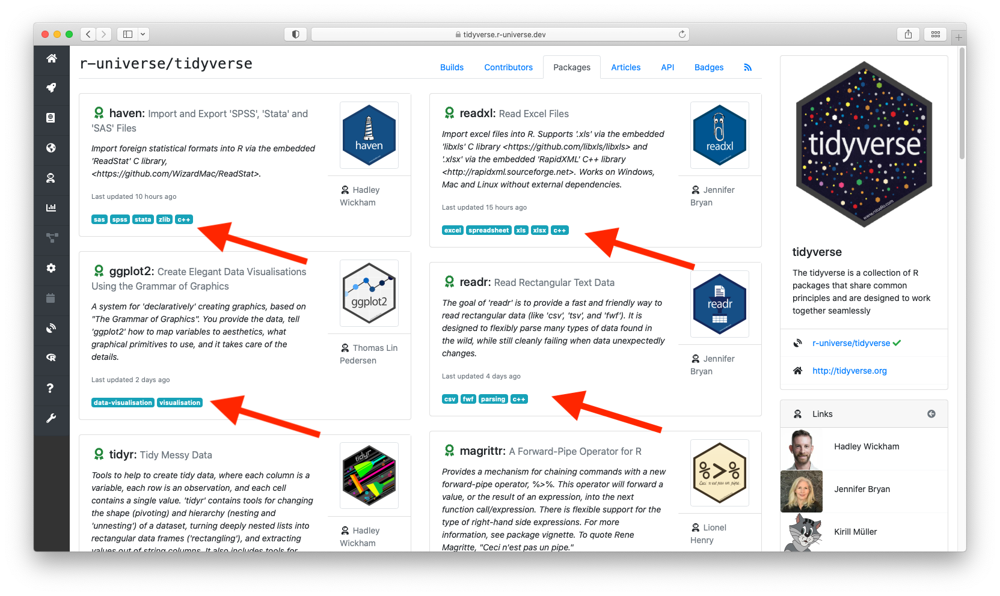

## R-universe now has search!

We made a series of structural improvements in r-universe to make it easier to browse and discover interesting R packages and articles.

Most notably, the [r-universe.dev](https://r-universe.dev) landing page has been overhauled: you can now search directly for any name or keyword across the entire ecosystem:

The homepage also lists the popular topics and organizations, and links to recently active packages, articles, and maintainers. [Give it a try](https://r-universe.dev) and search for any topic, author, or organization!

## Using package keywords

The search index matches words against package names, titles, descriptions, authors and vignette titles. Package authors can further improve discoverability of software and articles by setting __keywords__.

There are two ways to specify keywords for a package: if the R package is hosted on GitHub you can add keywords by configuring [repository topics](https://docs.github.com/en/repositories/managing-your-repositorys-settings-and-features/customizing-your-repository/classifying-your-repository-with-topics). This is the best way, because topics also make your package more discoverable on GitHub itself. For packages not hosted on GitHub, you can specify keywords in the `X-schema.org-keywords` field in your package `DESCRIPTION` file. This field [is permitted on CRAN](https://cs.github.com/?q=org%3Acran+X-schema.org-keywords) as well.

Keywords both help the package show up in search results, and are also displayed as labels in the packages tab. These labels are again clickable to easily discover other packages with the same keyword which may also be interesting.

In addition to manually specified keywords, the build system may also add some keywords automatically based on analysis of the package, including the names of [system libraries](https://r-universe.dev/sysdeps/) that the package links to such as [`gdal`](https://r-universe.dev/search/#gdal), or language tags such as [`c++`](https://r-universe.dev/search/#c++) or [`openmp`](https://r-universe.dev/search/#openmp).

## Publishing your packages and articles to R universe

Currently, r-universe is serving 3324 packages and 3291 articles by 929 maintainers. Want to add your own packages? Signing up is easy and only takes a minute. Packages on r-universe may be, but don't need to be on CRAN. In fact, packages that are not on CRAN may especially benefit from the extra visibility by publishing them on r-universe!

For more details read our blog post: [how to create your personal CRAN-like repository on R-universe](/blog/2021/06/22/setup-runiverse/).
