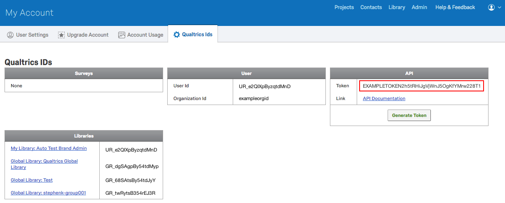
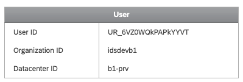
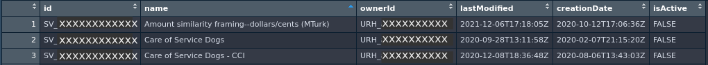

The online survey system [Qualtrics](https://www.qualtrics.com/) can be a great way to collect data from research participants, customers, and stakeholders. I use it frequently to conduct research studies with participants or just to poll students and collaborators. However, while Qualtrics makes survey design straightforward, once the data are collected, there is a lot of work to do. 
Fortunately, two R packages ([qualtRics](https://docs.ropensci.org/qualtRics/)[^1] and [excluder](https://docs.ropensci.org/excluder/)[^2]) can make importing data and excluding low-quality data easier. 

Discovering the qualtRics package has saved me a lot of time importing data. It also lets me create data pipelines for sensitive data by reading files directly into R without saving them locally until they've been deidentified. This way I don't accidentally save personally identifiable information in a place that is not authorized for sensitive data. 

After importing data, there is often a lot of clean up that needs to happen, especially for online survey respondents. I developed the excluder package to help with removing data entries based on broad metadata such as response duration, respondent location, screen resolution, etc. Combining the qualtRics and excluder packages can help you deal with the tedious part of survey data and quickly get to the fun part of data analysis!

Part 1 of this series will show you how to use qualtRics to import your data, and we'll cover excluding your data with excluder in Part 2. 

## Importing Qualtrics data into R

If you've worked with Qualtrics data before, you know you have to log into Qualtrics, navigate to the data section, wait for all of the data to be "re-indexed" for viewing, choose whether to export as numeric or character values, choose what type of file to export, download the data file, find the downloaded data file, change the name of the file to something comprehensible, and delete those first two obnoxious rows of metadata. 😮‍💨
Having to go through this process manually every time that you want to download Qualtrics data can be cumbersome and time consuming.

```{=html}

```
<!--  -->

Enter, the [qualtRics](https://docs.ropensci.org/qualtRics/) package from [Julia Silge](https://juliasilge.com/) and [Jasper Ginn](https://jasperhg90.github.io/)[^3]. 
This package allows you to use the Qualtrics API to directly connect to your survey data. 
You can download a list of surveys in your account, as well as the actual questions and metadata about those questions. But, most importantly, the qualtRics package allows you to download Qualtrics data into your R session. 
Therefore, you can write scripts that automatically import your Qualtrics data whenever you run your script. 
No more time wasted downloading manually!

### Connecting to Qualtrics

Of course, to get your data, you have to have access to your Qualtrics account. 
The [Qualtrics API](https://api.qualtrics.com/) allows you to connect to your Qualtrics account with your personal API token (or key) and your datacenter ID. 
You can [find your API token](https://api.qualtrics.com/ZG9jOjg3NjYzMg-api-key-authentication) by logging into Qualtrics, going to _Account Settings_, selecting the _Qualtrics IDs_ tab, finding the _API_ box, clicking _Generate Token_, and copying the long string of random letters and numbers shown next to _Token_. 
Note this key is like your password for accessing your account, so don't share it with others. 🤫

```{=html}

```
<!--  -->

For your datacenter ID, follow the same procedure but look in the _User_ box of the _Qualtrics ID_ page and grab the _Datacenter ID_.

```{=html}

```
<!--  -->

Your datacenter ID can now be appended before `qualtrics.com` to generate your base URL: `yourdatacenterid.qualtrics.com` (don't include `https://`). 
You can use the qualtRics function `qualtrics_api_credentials()` to connect your R session to the Qualtrics API.

```{r eval = FALSE}
library(qualtRics)

qualtrics_api_credentials(api_key = "<YOUR-QUALTRICS_API_TOKEN>", 
                          base_url = "<YOUR-QUALTRICS_BASE_URL>")
```

Now your R session should have access to your Qualtrics account. 
But if you start a new R session, you'll have to rerun this command. 
And it is not recommended to save this command in an R script because, if you send the script to someone else or post it publicly in a repository, you are granting access to your Qualtrics account to other people. 😬

To avoid having to rerun the command, you can store your API token and base URL on your local computer by using `install = TRUE`. 
Including this argument will save the API token and base URL information in your `.Renviron` file, which is read when starting every new R session.
```{r eval = FALSE}
qualtrics_api_credentials(api_key = "<YOUR-QUALTRICS_API_TOKEN>", 
                          base_url = "<YOUR-QUALTRICS_BASE_URL>",
                          install = TRUE)
```

Now you'll either need to restart your R session or reload your environment with `readRenviron("~/.Renviron")` to make the credentials accessible in the current R session.

If you use `install = TRUE`, this means that your credentials are stored in a plain text file on your computer. 
So this may not be something that you want to do on a shared computer account. 
You must decide between the security of not storing credentials on your computer and the convenience of not having to enter your credentials for every new R session. ⚖️

```{=html}

```
<!--  -->

Congrats---you've now registered your Qualtrics credentials! 🎉
If you have difficulty with this, check out the qualtRics  [documentation](https://docs.ropensci.org/qualtRics/articles/qualtRics.html#registering-your-qualtrics-credentials) or [GitHub issues](https://github.com/ropensci/qualtRics/issues), or the [Qualtrics API documentation](https://api.qualtrics.com/). 
If you have multiple Qualtrics accounts that you want you use, you'll have to get creative about how you [set up your API tokens](https://github.com/ropensci/qualtRics/issues/110).


### Listing your surveys

Now that you've connected to your Qualtrics account, one of the first things you may want to do is list the surveys that you have in your account. 
While you can do this by hand through the Qualtrics website, you can also download a list of all surveys as a data frame with [`all_surveys()`](https://docs.ropensci.org/qualtRics/reference/all_surveys.html).

```{r eval = FALSE, echo = TRUE}
surveys <- all_surveys() 
```

You can then view data frame to find the survey that you want.

```{r eval = FALSE, echo = TRUE}
View(surveys)
```

```{=html}

```
<!--  -->

The `id` column lists the survey ID for each survey (starting with `SV_`). 
This is a unique identifier that Qualtrics uses to label each survey. 
You will need the survey ID to download or work with it, so make sure to copy it from the data frame.


### Importing surveys

Now that we know which survey we want, we can import it using [`fetch_survey()`](https://docs.ropensci.org/qualtRics/reference/fetch_survey.html) and the survey ID.

```{r eval = FALSE, echo = TRUE}
mysurvey <- fetch_survey(surveyID = "SV_XXXXXXXXXX")
```

This imports the survey as a data frame. The `fetch_survey()` function has many arguments that are helpful in importing your data. 
Here are just a few:

* Set your time zone with `time_zone`. 
This is important because, if you don't set it in your Account Settings, Qualtrics has a default time zone that may differ from your own.

* Extract entries during a particular time period with `start_date` and/or `end_date`.

* Import only certain questions with `include_questions`.

* Control whether you import choice text or numeric data with `label`.

* Let the function try to guess the proper data types for your columns with `convert` or specify the data types with `col_types`.

* Save your data frame locally with the `save_dir` argument. 
Note it saves the file as an RDS file, so you'll need something like [`readRDS()`](https://rdrr.io/r/base/readRDS.html) to read it.

Find out more about this function in the [`fetch_survey()` documentation](https://docs.ropensci.org/qualtRics/reference/fetch_survey.html).

`fetch_survey()` allows you to automatically import your Qualtrics surveys directly---no more messy and time-consuming downloads! 
But if you've already downloaded a file from Qualtrics, you can use qualtRics' [`read_survey()`](https://docs.ropensci.org/qualtRics/reference/read_survey.html) function to import that file and clean up some Qualtrics messiness like removing those first two obnoxious rows and allowing control over the time zone and column data types.

### Viewing survey info

While `fetch_survey()` provides the core functionality of the qualtRics package, the package also includes some other helper functions that allow you to view information about your survey.

You can get a data frame that includes all survey questions and their IDs and names with [`survey_questions()`](https://docs.ropensci.org/qualtRics/reference/survey_questions.html). 
To really drill down into your survey, use the [`metadata()`](https://docs.ropensci.org/qualtRics/reference/metadata.html) function. 
Not only can you access general metadata about your survey (survey name, owner ID, organization ID, creation/modification dates), but you can get more detailed information about your questions (question labels, question type, response option descriptions), block information, and survey flow. 
You can access information about the survey distribution, mailing lists, etc. with other functions. 
It's definitely worth exploring all of the [helper functions](https://docs.ropensci.org/qualtRics/reference/index.html).


## Next steps

You have learned a quick and easy way to automatically download your Qualtrics data with the qualtRics package. 😎
Now what do you do with it? 
Well, if you're collecting online surveys, you may have a lot of problematic data that you want to remove. 
Check out Part 2: Excluding Data (coming next week!) to find out how to exclude data with the [excluder](https://docs.ropensci.org/excluder/) package.


[^1]: Ginn J, Silge J (2022). qualtRics: Download 'Qualtrics' Survey Data. R package version 3.1.6,
  https://CRAN.R-project.org/package=qualtRics
[^2]: Stevens, J. R. (2021). excluder: An R package that checks for exclusion criteria in online data. _Journal of Open Source Software_, 6(67), 3893. <https://doi.org/10.21105/joss.03893>
[^3]: Many thanks to Julia Silge and Jasper Ginn for creating a wonderful package and providing the [documentation](https://docs.ropensci.org/qualtRics/) and [vignette](https://docs.ropensci.org/qualtRics/articles/qualtRics.html) on which this post was based! Also, check out Julia's blog post about [relaunching the qualtRics package](/blog/2019/04/30/qualtrics-relaunch/).
