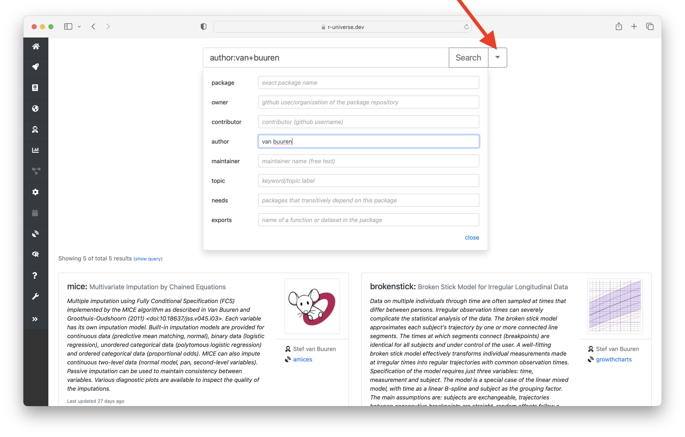

<!-- Before sending DELETE THE INDEX_CACHE and re-knit! -->

Dear rOpenSci friends, it's time for our monthly news roundup!
<!-- blabla -->
You can read this post [on our blog](/blog/2022/10/21/ropensci-news-digest-october-2022).
Now let's dive into the activity at and around rOpenSci!

## rOpenSci HQ

### rOpenSci Champions Program: call for Champions and call for Mentors

The [rOpenSci Champions Program](/champions/) is part of a series of activities and projects we are carrying out to ensure our research software serves everyone in our communities. 
That is why this program focuses on __people who belong to groups that are historically and systematically excluded__ from the open software and research software communities and who are interested in contributing to rOpenSci and the broader open source and research software communities.

#### Call for Champions

If you are selected as a Champion, over the course of a year you will develop a project, get training, and be mentored. You will also receive a small stipend. 

You can apply until **November 7, 2022** with this [form](/champions/#how-to-apply).  You can read more details in this [blog post](/blog/2022/09/22/launch-champions-program/).

#### Call for Mentors

### Introducing R-universe power search

Earlier this year we announced [R-universe search](https://ropensci.org/blog/2022/03/23/runiverse-search/) which lets you easily browse and discover R packages across the various R ecosystems. We have now upgraded the search system to support advanced search queries, to search for particular properties of an R package.



Advanced search lets you query packages that specifially match a particular author, maintainer, keyword, or topic. But you can also filter based on metadata derived by the build system, for example packages that contain a particular function or dataset, or packages with a particular contributor or dependency.

To give it a try, simply go to https://r-universe.dev and click the advanced search icon:

### Coworking sessions continue!

Join us for social coworking & office hours monthly on first Tuesdays! 
Hosted by Steffi LaZerte and various community hosts. 
Everyone welcome. 
No RSVP needed. 
Consult our [Events](/events) page to find your local time and how to join.

* [Tuesday, November 1st 9 AM North American Pacific / 16:00 UTC ](/events/coworking-2022-11/) "Champions Program Application Clinic" *Hosted by rOpenSci community manager [Yanina Bellini Saibene](/author/yanina-bellini-saibene/) and [Steffi LaZerte](/author/steffi-lazerte/)*
    * Prepare your application for the Champions Program.
    * Talk to [Yanina](/author/yanina-bellini-saibene/) about the application process.
    * Cowork independently on work related to R. Work on packages that tend to be neglected; What ever you need to get done!
    
* [Tuesday, December 6th, 9 AM Australian Western / 1:00 UTC](/events/coworking-2022-12/) "Getting started with targets!" *Hosted by community host [Nick Tierney](/author/nicholas-tierney/) and [Steffi LaZerte](/author/steffi-lazerte/)*
    - Dive into the world of targets! Do some studying; Start setting it up for some of your projects;
    - Ask [Nick](/author/nicholas-tierney/) for suggestions how how to get started or tips and tricks;
    - Cowork independently on work related to R. Work on packages that tend to be neglected; What ever you need to get done!
    
### We reboot our Community Calls !

and we do it with a [meeting to talk about Mentoring & training program for Scientific Open Source Champions](/commcalls/oct2022-champions/).

On this call _Santosh Yadav_ and _Emanuele Bartolesi_ will share their experience of being champions in their communities. We will highlight the benefits of being part of a champions program for you and for your community, and what kind of learning, activities, and opportunities an open source community champions program provides. _Yani_ will present the details of our Champion Program and answer all your questions about it.

You can [access all the meeting details on this post.]((/commcalls/oct2022-champions/)). We look forward to seeing you!

### Check out our Calls for new maintainers!

Some of our packages are looking for new maintainers or co-maintainers, read the [blog post presenting them](/blog/2022/10/17/maintain-or-co-maintain-an-ropensci-package/).

## Software :package:

### New packages

The following  package recently became a part of our software suite:

Discover [more packages](/packages), read more about [Software Peer Review](/software-review).

### New versions

The following thirteen packages have had an update since the last newsletter: [gert](https://docs.ropensci.org/gert "Simple Git Client for R") ([`v1.9.1`](https://github.com/r-lib/gert/releases/tag/v1.9.1)), [aorsf](https://docs.ropensci.org/aorsf "Accelerated Oblique Random Survival Forests") ([`v0.0.3`](https://github.com/ropensci/aorsf/releases/tag/v0.0.3)), [bibtex](https://docs.ropensci.org/bibtex "Bibtex Parser") ([`v0.5.0`](https://github.com/ropensci/bibtex/releases/tag/v0.5.0)), [canaper](https://docs.ropensci.org/canaper "Categorical Analysis of Neo- And Paleo-Endemism") ([`v1.0.0`](https://github.com/ropensci/canaper/releases/tag/v1.0.0)), [cffr](https://docs.ropensci.org/cffr "Generate Citation File Format (cff) Metadata for R Packages") ([`v0.3.0`](https://github.com/ropensci/cffr/releases/tag/v0.3.0)), [FedData](https://docs.ropensci.org/FedData "Functions to Automate Downloading Geospatial Data Available from
    Several Federated Data Sources") ([`v3.0.0`](https://github.com/ropensci/FedData/releases/tag/v3.0.0)), [geojsonio](https://docs.ropensci.org/geojsonio "Convert Data from and to GeoJSON or TopoJSON") ([`v0.10.0`](https://github.com/ropensci/geojsonio/releases/tag/v0.10.0)), [osfr](https://docs.ropensci.org/osfr "Interface to the Open Science Framework (OSF)") ([`v0.2.9`](https://github.com/ropensci/osfr/releases/tag/v0.2.9)), [pdftools](https://docs.ropensci.org/pdftools "Text Extraction, Rendering and Converting of PDF Documents") ([`v3.2.1`](https://github.com/ropensci/pdftools/releases/tag/v3.2.1)), [qpdf](https://docs.ropensci.org/qpdf "Split, Combine and Compress PDF Files") ([`v1.3.0`](https://github.com/ropensci/qpdf/releases/tag/v1.3.0)), [RefManageR](https://docs.ropensci.org/RefManageR "Straightforward BibTeX and BibLaTeX Bibliography Management") ([`new`](https://github.com/ropensci/RefManageR/releases/tag/new)), [rerddap](https://docs.ropensci.org/rerddap "General Purpose Client for ERDDAP Servers") ([`v1.0.0`](https://github.com/ropensci/rerddap/releases/tag/v1.0.0)), and [targets](https://docs.ropensci.org/targets "Dynamic Function-Oriented Make-Like Declarative Workflows") ([`0.13.5`](https://github.com/ropensci/targets/releases/tag/0.13.5)).

## Software Peer Review

There are twelve recently closed and active submissions and 3 submissions on hold. Issues are at different stages: 

* One at ['5/awaiting-reviewer(s)-response'](https://github.com/ropensci/software-review/issues?q=is%3Aissue+is%3Aopen+sort%3Aupdated-desc+label%3A5/awaiting-reviewer(s)-response):

     * [phruta](https://github.com/ropensci/software-review/issues/458), Phylogenetic Reconstruction and Time-dating. Submitted by [Cristian Román Palacios](http://cromanpa94.github.io/cromanpa/). 

* Six at ['4/review(s)-in-awaiting-changes'](https://github.com/ropensci/software-review/issues?q=is%3Aissue+is%3Aopen+sort%3Aupdated-desc+label%3A4/review(s)-in-awaiting-changes):

     * [daiquiri](https://github.com/ropensci/software-review/issues/535), Data Quality Reporting for Temporal Datasets. Submitted by [Phuong Quan](https://github.com/phuongquan). 

    * [hudr](https://github.com/ropensci/software-review/issues/524), A R interface for accessing HUD (US Department of Housing and Urban Development) APIs. Submitted by [Emmet Tam](https://github.com/etam4260/etam4260). 

    * [octolog](https://github.com/ropensci/software-review/issues/502), Better Github Action Logging. Submitted by [Jacob Wujciak-Jens](https://github.com/assignUser). 

    * [tsbox](https://github.com/ropensci/software-review/issues/464), Class-Agnostic Time Series. Submitted by [Christoph Sax](http://www.cynkra.com).  (Stats).

    * [healthdatacsv](https://github.com/ropensci/software-review/issues/358), Access data in the healthdata.gov catalog. Submitted by [iecastro](http://iecastro.netlify.com). 

    * [daiquiri](https://github.com/ropensci/software-review/issues/535), Data Quality Reporting for Temporal Datasets. Submitted by [Phuong Quan](https://github.com/phuongquan). 

* One at ['3/reviewer(s)-assigned'](https://github.com/ropensci/software-review/issues?q=is%3Aissue+is%3Aopen+sort%3Aupdated-desc+label%3A3/reviewer(s)-assigned):

     * [dynamite](https://github.com/ropensci/software-review/issues/554), Bayesian Modeling and Causal Inference for Multivariate. Submitted by [Santtu Tikka](http://users.jyu.fi/~santikka/).  (Stats).

* Three at ['2/seeking-reviewer(s)'](https://github.com/ropensci/software-review/issues?q=is%3Aissue+is%3Aopen+sort%3Aupdated-desc+label%3A2/seeking-reviewer(s)):

     * [stochLAB](https://github.com/ropensci/software-review/issues/551), Stochastic Collision Risk Model. Submitted by [Grant](http://www.blackbawks.net).  (Stats).

    * [wmm](https://github.com/ropensci/software-review/issues/522), World Magnetic Model. Submitted by [Will Frierson](https://github.com/wfrierson). 

    * [bssm](https://github.com/ropensci/software-review/issues/489), Bayesian Inference of Non-Linear and Non-Gaussian State Space. Submitted by [Jouni Helske](http://jounihelske.netlify.app).  (Stats).

* One at ['1/editor-checks'](https://github.com/ropensci/software-review/issues?q=is%3Aissue+is%3Aopen+sort%3Aupdated-desc+label%3A1/editor-checks):

     * [dfms](https://github.com/ropensci/software-review/issues/556), Dynamic Factor Models. Submitted by [Sebastian Krantz](https://github.com/SebKrantz). 

Find out more about [Software Peer Review](/software-review) and how to get involved.

## On the blog

<!-- Do not forget to rebase your branch! -->

## Use cases

Two use cases of our packages and resources have been reported since we sent the last newsletter.

* [Using a targets pipeline to query data from the Water Quality Portal](https://discuss.ropensci.org/t/using-a-targets-pipeline-to-query-data-from-the-water-quality-portal/3140). Reported by Julie.

* [Backing up GitHub organisation with gitcellar](https://discuss.ropensci.org/t/backing-up-github-organisation-with-gitcellar/3153). Reported by Hugo Gruson.

Explore [other use cases](/usecases) and [report your own](https://discuss.ropensci.org/c/usecases/10)!

## Call for maintainers

Following our annual maintainer survey, we identified packages in need of a new maintainer or of co-maintainer.
Read more about them, and why to maintain or co-maintain a package, in our dedicated blog post ["Maintain or Co-Maintain an rOpenSci Package!"](/blog/2022/10/17/maintain-or-co-maintain-an-ropensci-package/).

## Package development corner

Some useful tips for R package developers. :eyes:

### Are you ready to develop packages?

If the question applies to _you_ as an R user, know that in [Susan Johnston’s wise words](https://github.com/susjoh/fibonacci), if you can open R, if you can install a package, if you can write functions or learn how to write functions, you can write an R package! If you're still not sure please refer to the resources listed in our [dev guide](https://devguide.ropensci.org/building.html#learning-about-package-development).

On the other hand, if this question applies to _your machine_, you might use the following functions to find out:

* [`devtools::dev_sitrep()`](https://devtools.r-lib.org/reference/dev_sitrep.html);
* [`devtools::has_devel()`](https://r-lib.github.io/pkgbuild/reference/has_compiler.html);
* [`usethis::git_sitrep()`](https://usethis.r-lib.org/reference/git_sitrep.html).

These functions can also be run at any point during your package development work, even once you're used to such work, as they might help you understand why something "weird" is happening.

### How to run code during package installation?

If for any reason you ever need to run code during the installation of your package, know that it is possible as [noted by Gábor Csárdi on RStudio community forum](https://community.rstudio.com/t/is-it-possible-to-run-a-command-during-package-install/147192/4).
The example given, from [purrr](https://github.com/tidyverse/purrr/blob/f67f77134cd258fced27834595c4091f49be62e1/configure), consists in adding a [note before examples for older versions of R](https://github.com/tidyverse/purrr/blob/f67f77134cd258fced27834595c4091f49be62e1/inst/tools/examples.R).

Now if your goal is to install an external software, as noted in the forum answer it might be better to provide a function for the users to install the software.
Then you could also provide a sitrep function for checking the installation, like the sitrep functions mentioned in the previous tip!

### Optional (Suggests) dependency that has been archived on CRAN

An interesting challenge reported on [rOpenSci forum](https://discuss.ropensci.org/t/optional-suggests-dependency-that-has-been-archived-on-cran/3071): can a package on CRAN depend on a package that has been archived on CRAN?
[Jeffrey Hanson](https://jeffrey-hanson.com/) wrote, after successfully updating the [prioritizr](https://cran.r-project.org/web/packages/prioritizr/index.html) package on CRAN despite its (Suggests) depending on [cplexAPI](https://cran.r-project.org/web/packages/cplexAPI/index.html),

> Just to follow up in case this helps anyone else, it would appear that it’s fine to have archived packages listed as Suggests for CRAN submission - as long as conditions for non-CRAN packages are met (e.g., listing URL for package install in the DESCRIPTION file).

Thanks to [Lluís Revilla Sancho](https://llrs.dev/) for his insights [in that same thread](https://discuss.ropensci.org/t/optional-suggests-dependency-that-has-been-archived-on-cran/3071/3).

## Last words

Thanks for reading! If you want to get involved with rOpenSci, check out our [Contributing Guide](https://contributing.ropensci.org) that can help direct you to the right place, whether you want to make code contributions, non-code contributions, or contribute in other ways like sharing use cases.

If you haven't subscribed to our newsletter yet, you can [do so via a form](/news/). Until it's time for our next newsletter, you can keep in touch with us via our [website](/) and [Twitter account](https://twitter.com/ropensci).
