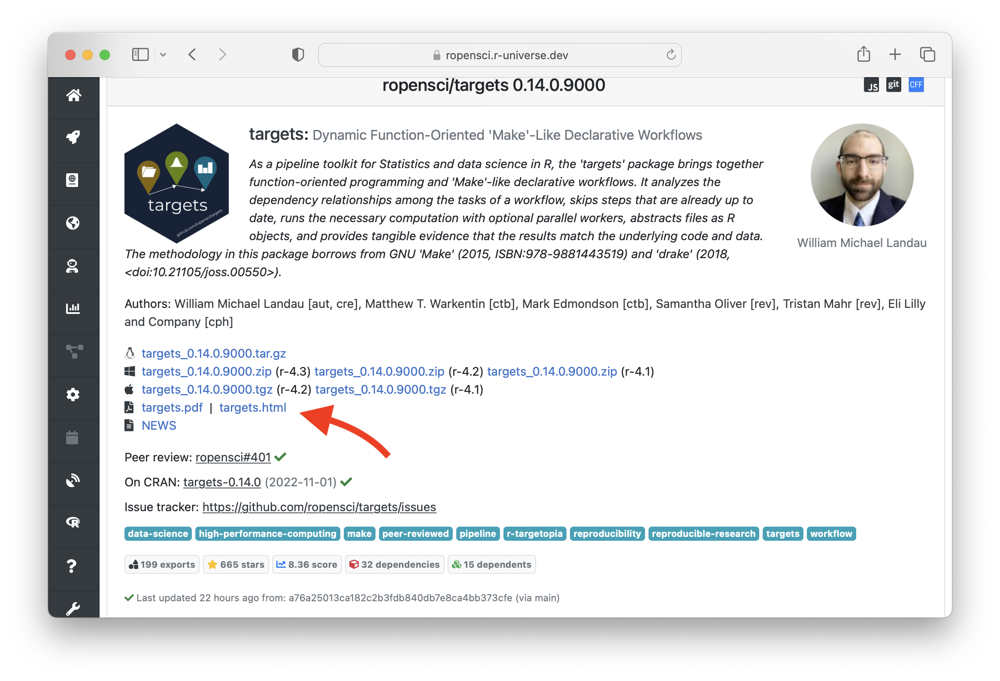

## Two new packages!

We released two new packages that we are using in [r-universe](https://r-universe.dev) to render package documentation: [postdoc](https://docs.ropensci.org/postdoc/) and [prismjs](https://docs.ropensci.org/prismjs/).

The goal of postdoc is very simple: generate beautiful single-page package manuals in HTML format. Postdoc uses our [prismjs](https://docs.ropensci.org/prismjs/) and [katex](https://docs.ropensci.org/katex/) packages for server-side highlighting and math. Try it yourself:

```r
# Download and install postdoc in R
install.packages('postdoc',
  repos = c('https://ropensci.r-universe.dev','https://cloud.r-project.org'))

# Generate a manual for 'jsonlite'
html <- postdoc::render_package_manual("jsonlite", ".")
utils::browseURL(html)
```

We have recently started building the reference manuals for each package r-universe: for packages that have had an update in the past 10 days, the reference manual is now linked from the package homepage on [r-universe.dev](https://r-universe.dev). All packages in in r-universe gets rebuilt at least once per month, so soon all packages should have the manual. Postdoc reference manuals for base-R packages can be found [here](https://r-universe.dev/manuals/).


[](https://ropensci.r-universe.dev/ui#package:targets)
Below some random examples of refence manuals from popular packages to get an impression:

 - [`https://ropensci.r-universe.dev/manual/targets.html`](https://ropensci.r-universe.dev/manual/targets.html)
 - [`https://tidyverse.r-universe.dev/manual/dplyr.html`](https://tidyverse.r-universe.dev/manual/dplyr.html)
 - [`https://jeroen.r-universe.dev/manual/jsonlite.html`](https://jeroen.r-universe.dev/manual/jsonlite.html)
 - [`https://rstudio.r-universe.dev/manual/shiny.html`](https://rstudio.r-universe.dev/manual/shiny.html)
 - [`https://r-universe.dev/manuals/MASS.html`](https://r-universe.dev/manuals/MASS.html)
 - [`https://r-universe.dev/manuals/Matrix.html`](https://r-universe.dev/manuals/Matrix.html) (lots of math)

## What is nice about a reference manual

There are many ways to browse R package documentation, such as a pkgdown site or the `?` command in R. But one of the simplest ways, that is available for all packages, is viewing the PDF reference manual in your browser from CRAN or r-universe.

The reference manual gives an overview of everything in the package, nicely indexed and searchable within a single document. Because it is just one file, it is easy to share and archive a particular version of the manual that belongs with a given version of the package. This makes a reference manual a useful resource, even for packages that have e.g. a pkgdown site.

Unfortunately, base-R can only generate reference manuals in PDF format. This is a long standing issue: Jonathan Godfrey published an article in the R journal 10 years ago called [*Statistical Software from a Blind Person’s Perspective*](https://journal.r-project.org/archive/2013-1/godfrey.pdf) in which he explains that the PDF format is terrible for him because it is not machine readable and hence does not work well with screen readers. Earlier this year he [reiterated](https://stat.ethz.ch/pipermail/r-package-devel/2022q2/007953.html) some of these points on the mailing list, suggesting to switch to HTML where possible.


## Benefits of postdoc HTML manuals:

Besides accessibility, there are many other reasons HTML is a far superior format these days. Because it is text-based, it does not require special tooling to generate (such as latex) or a special viewer (e.g. mobile devices often don't have a pdf reader). With some CSS we can apply custom styling, without cluttering the content.
In summary, some benefits of postdoc HTML reference manuals:

 - Beautiful server-side math and syntax highlighting
 - Accessibility: works with screenreaders
 - Search simply with CTRL+F
 - Possible to link to a topic within the document
 - Link to HTML manuals of other packages
 - Readable by search engines
 - Opens in any browser, without PDF reader
 - Can be generate in R without LaTeX

Math rendering in HTML with katex or mathjax is these days on-par with LaTeX, and syntax highlighting far superior. Generally HTML documents are much more readable both for humans and machines. The latter will not only help screen-readers, but also make the documentation visible to search engines.

## Server-side syntax highlighting and math

This is the initial release of postdoc. The technical details are subject to change, and not very interesting to most people, but I want to emphasize one important feature: math rendering and syntax highlighting are done [server-side in R](blog/2021/07/13/katex-release/) such that no JavaScript libraries are needed in the html document. This makes the html portable and faster to load, which is nice because some manuals are quite large.

How does this work? Most other documentation systems insert JavaScript libraries in the HTML document which have to render/style math and code every time a page is loaded in the browser. However these libraries can be large and the rendering is expensive for documents with many equations/codeblocks. As a result a page can take long to load, especially with limited bandwidth/cpu, such as on mobile devices.

The postdoc package uses our [prismjs](https://docs.ropensci.org/prismjs/) and [katex](https://docs.ropensci.org/katex/) R packages to render the code and math respectively. These packages are based on the same JavaScript libraries, however instead of running in the browser, they run in R using [V8](https://jeroen.r-universe.dev/ui#package:V8). As a result, the heavy lifting is taken care of when the manual is generated, and the HTML contains the pre-rendered math figures and codeblocks. The only thing that remains to be needed in the HTML document is some small CSS files, which define e.g. the color theme for the code blocks, but do not require heavy computation.
