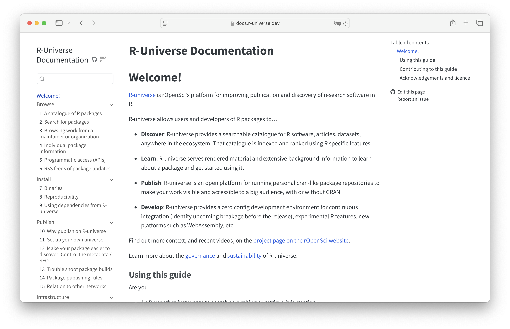
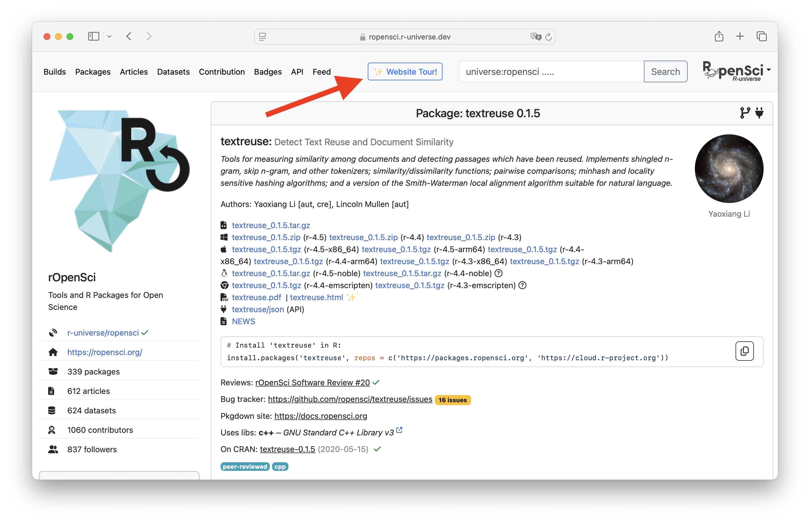

Since the initial launch in 2021, our [R-universe](https://r-universe.dev) platform has steadily grown into a comprehensive infrastructure for publishing and discovering R material. As functionality keeps evolving and community adoption increases, we felt the need for a central documentation point.

New R-universe features and developments are generally discussed in the [issue tracker](https://github.com/r-universe-org/help/issues), [discussion board](https://github.com/r-universe-org/help/discussions), and sometimes on the [ropensci blog](/technotes/). Technical details can be found in the README files and source code of the respective repositories under [r-universe-org](https://github.com/r-universe-org/) that contain all the workflows, actions, and server code (the R-universe system is entirely is open source). However this fragmentation can make it difficult to find up-to-date information, especially for new users.

Thanks to funding by [Google Season of Docs](/blog/2024/04/12/gsod-announcement/), we set out to begin a comprehensive documentation project for users and developers of R-universe. The goal is to esablish a central place where we collect the various sources of information and describe examples and use-cases, using standard tooling to aid collective maintenance.

## The new documentation website

The new R-universe documentation website is now live at <https://docs.r-universe.org>! You can find the source code on <https://github.com/r-universe-org/docs>.

We created it as a [Quarto book](https://quarto.org/docs/books/) 
as this is a common format that many members of the R community are used to reading (c.f. [R Packages](https://r-pkgs.org/), [R for Data Science](https://r4ds.hadley.nz/), [our development guide](https://devguide.ropensci.org/)[^babelquarto]) and can contribute to.

The documentation is currently organized into four main sections:

- **Browse** that documents the user experience navigating packages and universes.
- **Install** that explains how to install packages from R-universe, how to ensure reproducibility, and how to create a dependency on a package published on R-universe.
- **Publish** that focusses on the package developer experience: why and how to publish packages.
- **Infrastructure**, a very much in progress section aiming at documenting governance and funding but also how R-universe works under the hood.

In addition the website has search functionality, and features links to the GitHub repository where you can contribute to the documentation.

[^babelquarto]: Our dev guide is a special Quarto book, as it has multilingual support thanks to our R package [babelquarto](https://docs.ropensci.org/babelquarto).

We are thankful to the documentation reviewers [Lluís Revilla](/author/lluís-revilla-sancho/) and [Yaoxiang Li](/author/yaoxiang-li/) who provided insightful feedback that helped us improve the initial version of the website.

## Interactive website tour 

Besides a new docs site, we also added an _embedded_ documentation tour into the website: each package page has a ["Website tour" button](https://docs.r-universe.dev/browse/packages.html#website-tour) in the navbar, that guides you through all the information displayed on the page. Go give it a try!

## A streamlined docs experience

While working on the documentation we also updated other information sources: 

We simplified the [R-universe project page on the rOpenSci website](/r-universe) for it to only contain a big picture description of the project, as well as links to relevant resources including the documentation website, technical notes, recent talk recordings.
That web page is also available in [Spanish](/es/r-universe/).

The README on the [organization profile on GitHub](https://github.com/r-universe-org/) is updated to list relevant websites and online spaces such as the docs, obviously, but also the discussion board and general issue tracker. Finally the former [FAQ list](https://github.com/r-universe-org/help) was retired and replaced with links to relevant docs chapters, and references on where to get help and participate to the project.

## Conclusion

The new docs project will become the central place where we maintain up-to-date information for users and developers of R-universe. The current version of the site has the most important bits, but is far from complete.  Just like R-universe itself, the documentation site is a living project that has to grow iteratively based on your needs and contributions.

If you have used R-universe in one way or another, and have ideas on how documentation could be improved, we welcome your issue or pull request on the [r-universe-org/docs](https://github.com/r-universe-org/docs) repo on GitHub.

