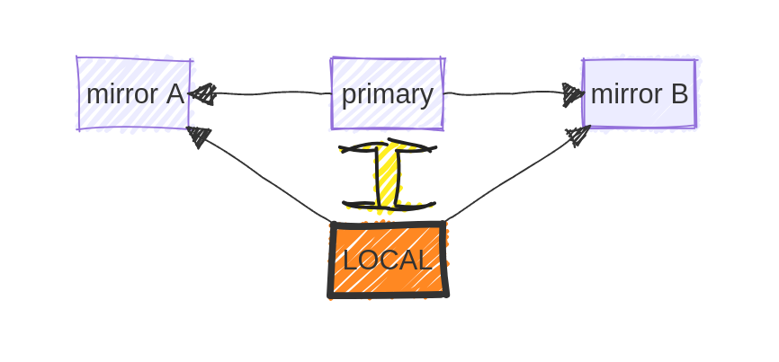
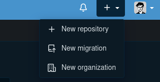
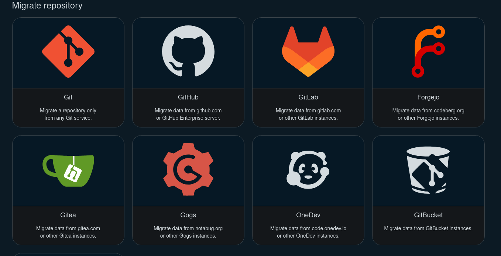

rOpenSci peer-review has to date been exclusively conducted [on GitHub](https://github.com/ropensci/software-review/issues?q=sort%3Aupdated-desc%20is%3Aissue%20state%3Aclosed).
We are not planning on moving away from this system any time soon, but are nonetheless aware that many people prefer alternative platforms.
rOpenSci also has an organizational presence on both [GitLab](https://gitlab.com/ropensci) and [Codeberg](https://codeberg.org/ropensci).
This post describes how rOpenSci community members can use these - and any other - alternative platforms.

## Code (still) needs a single home

All platforms described here are based on [Git](https://git-scm.com/), which is generally used in a centralized way, through associating code with a single, main repository to which changes can be _pushed_, or from which changes can be _pulled_.
There is thus a single connection between code on your local machine and this single main version.
Code can of course be hosted anywhere, and we aim here to show how easy it is for code to be simultaneously hosted on an arbitrary number of platforms.

Hosting code in multiple locations creates multiple connections between local and remote versions.
This can easily create conflicts in Git.
To keeps things simple, this post will therefore presume that every repository maintains a single, primary home on one platform, with other platforms hosting or "mirroring" copies of the code.

## Mirroring on other platforms

Different remote instances of a Git repository are often referred to as "mirrors".
This is potentially confusing because (among other reasons) a mirror is a two-way thing, whereas mirroring of repositories is often one-way only.
As said above, we presume here that code has a single, primary remote home on one platform.
The term "mirror" is then used here to refer to locations on any platforms other than the primary remote home.

Code mirrors are only ever updated through `git push` events from either local or primary remote versions.
Code may be directly updated on the primary remote version (for example, through merging branches), with changes generally incorporated in a local version via `git pull`, and then pushed out to all mirrored versions.
A `git pull` command should only ever be applied to the primary remote version, and never to any alternative mirror versions.
In this diagram, the large yellow arrow represents the only connection where both `push` and `pull` events are allowed.
All other arrows are `push` events only.



### Mirroring on codeberg

The easiest platform on which to mirror your code is currently [Codeberg](https://codeberg.org), which has inbuilt options to mirror repositories directly from a large number of other platforms, including GitHub.
[Codeberg](https://codeberg.org) can also mirror all issues and pull requests, although the contributors will no longer be hyperlinked (see an [example here](https://codeberg.org/ropensci/osmdata/issues/388)).
To mirror a repo on Codeberg, click the large "+" button on the top right of the main menu bar, and select "New migration", like this:

That will then open up the following grid of options from where you want to mirror your repository:



To migrate from GitHub, click the symbol to open a migration to fill in some details, where you can also paste a GitHub token into "access token", and mirror almost all other aspects, including issues, pull requests, and releases.
Note that the migration process may take 10 minutes or more.

### Mirroring elsewhere

No other platforms currently offer the one-click mirror functionality of Codeberg.
To mirror in all other cases, you'll need to:
1. Create a new repository on the desired platform.
2. Set a `git remote` URL to the new destination.
3. `git push` to new remote.

The [git remote web page](https://git-scm.com/book/en/v2/Git-Basics-Working-with-Remotes) provides more detail on working with remotes.

## Managing one repository across multiple platforms

As described above, the easiest way to manage one Git repository across multiple platforms is to use one primary source to which you `push`, and from where you may `pull`.
All other remote origins should be considered `push` mirrors only, and never `pull`.
In the rare case that conflicts from other sources arise, you may need to `git push --force` to _other_ remotes (or the [safer version of `git push --force-with-lease`](https://git-scm.com/docs/git-push#Documentation/git-push.txt---force-with-leaserefnameexpect)).
You should never `git push --force` to the main branch of your primary source.

For each additional remote source, you'll need to add a remote URL with [`git remote add`](https://git-scm.com/docs/git-remote).
There are many ways to do this.
The pure Git way of managing multiple remote sources is to take advantage of `git remote set-url --add` to add additional URLs to a single remote identifier.
[This blog post](https://jeffkreeftmeijer.com/git-multiple-remotes/) details how to do that safely, to ensure only one primary remote is configured to `fetch`, while allowing `push` events to all others.
An alternative option would be to initially create an additional remote like `git remote add other https://codeberg.org/ropensci/my-package`.
You can then extend that with each additional remote URL with `set-url --add`.
Running `git push other <branch>` will then push that branch to all remote URLs specified in `other`.

Yet another approach is to define a [custom command](https://stackoverflow.com/questions/60060217/how-do-i-make-custom-git-commands) for `git push` to call a local script.
This can be done by adding some "gitbin" directory to a default system `PATH` variable (in `.bashrc`, for example, as `export PATH="$PATH:$HOME/.gitbin"`).
Git will automatically recognise any scripts within `$PATH` named with the prefix "git-".
It is best to name locally-defined Git commands differently to standard Git commands.
For example, a file named `git-pushall` placed in that folder will be called by the `git pushall` command.
The file itself could contain any of the options described in [this StackOverflow answer](https://stackoverflow.com/a/18674313).
Even more arcane alternatives include my own [git push bash script](https://github.com/mpadge/dotfiles/blob/main/system/gitpush.bash) which recreates the now obsolete push-by-password functionality of GitHub, while also pushing to all other listed remote sources.

## rOpenSci repos on Codeberg and GitLab

We don't yet have any automated tooling for authors to rOpenSci packages to mirror repositories on other platforms.
If you are an author of an rOpenSci package, and would like to set up mirrors on either [Codeberg/ropensci](https://codeberg.org/ropensci) or [GitLab/ropensci](https://gitlab.com/ropensci), you'll have to ask us to do the initial set up.
The best way is to ping @ropensci/admin directly from a GitHub issue in your repository, and we'll start the process.

## Using a main source other than GitHub

Authors of rOpenSci packages may also use platforms other than GitHub as the main source for their repository code.
As with mirroring, Codeberg is currently the best platform to use instead of GitHub, because it has inbuilt abilities to push code to any other locations.
Once you've set up an rOpenSci repository on Codeberg, you can go to the settings, where one of the first options under "Repository" is "Mirror settings".
Here you can configure any other locations as push mirrors.
From that point on, you should only ever `git push` directly to Codeberg, and every push there will be mirrored by Codeberg to all other specified locations, potentially including GitHub.
