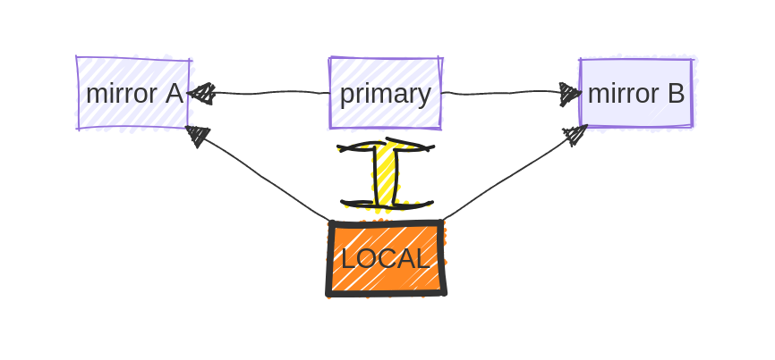
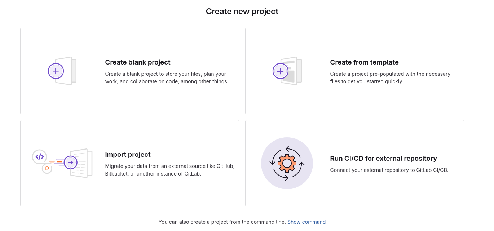

rOpenSci peer-review has to date been exclusively conducted [on GitHub](https://github.com/ropensci/software-review/issues?q=sort%3Aupdated-desc%20is%3Aissue%20state%3Aclosed).
We are not planning on moving away from this system any time soon, but are nonetheless aware that many people prefer alternative platforms.
rOpenSci also has an organizational presence on both [GitLab](https://gitlab.com/ropensci) and [Codeberg](https://codeberg.org/ropensci).
This post describes how rOpenSci community members can use these - and any other - alternative platforms[^1]
The use of alternative platforms is a form of decentralization, with each additional platform used lowering the risk of negative consequences associated with any particular platform.

[^1]: [tangled](https://tangled.org) is a _distributed_ system for code hosting, so technically not a platform, and the "backend" of Codeberg, [forgejo](https://forgejo.org/), also [supports federation](https://forgejo.org/faq/#is-there-a-roadmap-for-forgejo).
We nevertheless use the word "platform" to simply any cost-hosting system, including [tangled](https://tangled.org), and other federated systems.

## Code (still) needs a single home

All platforms described here are based on [Git](https://git-scm.com/), which is generally used in a centralized way, through associating code with a single, main repository to which changes can be _pushed_, or from which changes can be _pulled_.
This kind of workflow assumes a single connection between code on your local machine and this single main version.
Code can of course be hosted anywhere, and we aim here to show how easy it is for code to be simultaneously hosted on an arbitrary number of platforms.

Hosting code in multiple locations creates multiple connections between local and remote versions.
This can easily create conflicts in Git.
To keeps things simple, this post will therefore presume that every repository maintains a single, primary home on one platform, with other platforms hosting or "mirroring" copies of the code.

## Mirroring on other platforms

Different remote instances of a Git repository are often referred to as "mirrors".
This is potentially confusing because (among other reasons) a mirror is a two-way thing (object -> mirror -> reflection), whereas mirroring of repositories is often one-way only (source -> mirror, but not back again).
As said above, we presume here that code has a single, primary remote home on one platform.
The term "mirror" is then used here to refer to locations on any platforms other than the primary remote home.
Most examples presume GitHub to be the primary remote home, because rOpenSci operations are (still) built around that presumption, but any platform can serve as a primary remote location, with GitHub, and any number of other platforms then being mirrors.
"Alternative locations" just implies any additional mirror locations other than the primary home.

Code mirrors are only ever updated through `git push` events from local versions, or from other `git` events on the primary remote (such as merges or direct commits).
Change events originating on the primary remote are generally incorporated in a local version via `git pull`, and then pushed out to all mirrored versions.
A `git pull` command should only ever be applied to the primary remote version, and never to any alternative mirror versions.
In this diagram, the large yellow arrow represents the only connection where both `push` and `pull` events are allowed.
All other arrows are `push` events only.



### Mirroring on Codeberg or GitLab

The easiest platforms on which to mirror your code are currently [Codeberg](https://codeberg.org) and [GitLab](https://gitlab.com), both of which have inbuilt options to mirror repositories directly from a large number of other platforms, including GitHub.
Both of these platforms can also mirror additional information including issues, issue labels, pull requests, and releases.
Note, however, than many hyperlinks within issues and pull requests may be lost.
(The exception is that hyperlinks to contributors may optionally be retained on GitLab.)

To mirror a repo on Codeberg, click the large "+" button on the top right of the main menu bar, and select "New migration", like this:



That will then open up the following grid of options from where you want to mirror your repository:



To migrate from GitHub, click the symbol to open a migration to fill in some details, where you can also paste a GitHub token into "access token", and mirror almost all other aspects, including issues, pull requests, and releases.
Note that the migration process may take 10 minutes or more.

On GitLab, the equivalent "+" button is on the top left, where "_New project/repository_" should be clicked:



That will lead to the following options, in which "Import project" should be clicked.



That then leads to a list of platforms from which you can import projects, including code, issues, pull requests, releases, and other information.

### Mirroring elsewhere

No other platforms currently offer the one-click mirror functionality of Codeberg or GitLab.
To mirror in all other cases, you'll need to:

1. Create a new repository on the desired platform.
2. Set a `git remote` URL to the new destination.
3. `git push` to new remote.

The [git remote web page](https://git-scm.com/book/en/v2/Git-Basics-Working-with-Remotes) provides more detail on working with remotes.

## Transferring issues

Issues, pull requests, and other information on GitHub can be transferred both to Codeberg and GitLab, but only when a repository is first mirrored.
We are not currently aware of any platforms other these two which offer inbuilt ability to import additional information on issues and pull requests, although other people have implemented things such as [issue mirroring from GitHub to sourcehut](https://github.com/marketplace/actions/sourcehut-issue-maker).

Both Codeberg and GitLab enable all information on all issues and pull requests to be transferred across, although generally without hyperlinks other than those those linking within or between issues of the same repository.
All other hyperlinks, including any to GitHub users, or to other repositories, will be lost (although GitLab does provide some options for retaining hyperlinks to collaborators).
Moreover, the transfer will be of information at the time the "New migration" on Codeberg or "New import" on GitLab is initiated.
From that time point on, any activity via issues or pull requests on any hosting platform will be specific to that platform only.
Continuous mirroring is nevertheless possible, via actions such as [GitHubCodebergMirror](https://codeberg.org/wl/GithubCodebergMirror).

To transfer issues from GitHub to Codeberg, first click on the "GitHub" symbol in the "Migrate repository" options shown above, after which appears a dialog with options for what you would like migrated.
These options include "issues", "Pull requests", "Labels", "Milestones", and "Releases," also with the clear information that,

> Access token is required to migrate additional items

For that, you just need to paste a GitHub token in the Codeberg field, ensuring that the token has at least read access to all aspects you want transferred.
GitLab transfers issues, pull requests, tags, and releases by default, with even more possible through provision of a GitHub access token.
In both cases, transfer can take some time (10-20 minutes or more), following which all issues will appear exactly as on GitHub, but generally minus the hyperlinks described above.
Other code hosting platforms like [SourceHut](https://sr.ht/), or the distributed hosting system [tangled](https://tangled.org/) do not provide facilities for directly transferring or mirroring issues or pull requests (and in fact generally don't even have such things, as they really are specific to the GitHub platform; [SourceHut](https://sr.ht), for example, implements its own systems of "todos" and "patches".)

## Managing one repository across multiple platforms

To be clear, this entire post is about moving away from having code hosted on a single platform, to distributing across multiple platforms through _mirroring_.
If, for example, you only want to migrate away from GitHub to some single, other platform, then both Codeberg and GitLab already offer the full solutions described above.
We nevertheless recommend mirroring across multiple platforms, to reduce risks associated with dependence on any single platform.

As described above, the easiest way to manage one Git repository across multiple platforms is to use one primary source to which you `push`, and from where you may `pull`.
All other remote origins should be considered `push` mirrors only, and never `pull`.
In the rare case that conflicts from other sources arise, you may need to `git push --force` to _other_ remotes (or the [safer version of `git push --force-with-lease`](https://git-scm.com/docs/git-push#Documentation/git-push.txt---force-with-leaserefnameexpect)).
You should never `git push --force` to the main branch of your primary source.

### Adding remotes to your local Git information

For each additional remote source, you'll need to add a remote URL with [`git remote add`](https://git-scm.com/docs/git-remote).
There are many ways to do this.
The pure Git way of managing multiple remote sources is to take advantage of `git remote set-url --add` to add additional URLs to a single remote identifier.
[This blog post](https://jeffkreeftmeijer.com/git-multiple-remotes/) details how to do that safely, to ensure only one primary remote is configured to `fetch`, while allowing `push` events to all others.
An alternative option would be to initially create an additional remote like `git remote add other https://codeberg.org/ropensci/my-package`.
You can then extend that with each additional remote URL with `set-url --add`.
Running `git push other <branch>` will then push that branch to all remote URLs specified in `other`.

Yet another approach is to define a [custom command](https://stackoverflow.com/questions/60060217/how-do-i-make-custom-git-commands) for `git push` to call a local script.
This can be done by adding some "gitbin" directory to a default system `PATH` variable (in `.bashrc`, for example, as `export PATH="$PATH:$HOME/.gitbin"`).
Git will automatically recognize any scripts within `$PATH` named with the prefix "git-".
It is best to name locally-defined Git commands differently to standard Git commands.
For example, a file named `git-pushall` placed in that folder will be called by the `git pushall` command.
The file itself could contain any of the options described in [this StackOverflow answer](https://stackoverflow.com/a/18674313).
Even more arcane alternatives include my own [git push bash script](https://github.com/mpadge/dotfiles/blob/main/system/gitpush.bash) which recreates the now obsolete push-by-password functionality of GitHub, while also pushing to all other listed remote sources.

### Synchronizing multiple remotes

As with `git remote` setups described above, there are several ways to synchronize multiple remote instances of a single repository.
The pure Git way is to use local commands like those described and linked to above, to `git push` changes to all remote locations.
(This is the approach recommended by GitHub, but GitHub is an anomaly among code hosting platforms in offering no easy ability to interact with other platforms.)

Both Codeberg and GitLab offer mirroring services to enable these sites to be used as a primary site, and to mirror all code changes directly across to any alternative site such as GitHub.
Codeberg has a "Mirror settings" option near the top of the general repository "_Settings_" panel, where you can easily specify an arbitrary number of mirror locations, and click "_Sync when commits are pushed_".
The GitLab settings are under "_Settings_" &rarr; "_Repository_", where you should see options for "_Mirroring repositories_".
Depending on how you configure your other repositories, you may need to add additional information such as public SSH keys to authenticate `git push` events.
Common options are described in [GitLab's documentation](https://docs.gitlab.com/user/project/repository/mirror/).

Finally, if you want to keep GitHub as your primary home while avoiding having to remember to use `git pushall` or whatever other local setup you may have or need, you can easily set up a GitHub action to automatically push your code across to any other locations.
While there are "marketplace" actions available to do this, we do not recommend those, as the procedure is very straightforward, and implementing your own is generally easier.
An example is [this workflow](https://github.com/ropensci/osmdata/blob/main/.github/workflows/push-to-elsewhere.yaml) which is run on every `push` event to the main branch and mirrors the [`github.com/ropensci/osmdata`](https://github.com/ropensci/osmdata/tree/main) repository across to both [`codeberg.org/ropensci/osmdata`](https://codeberg.org/ropensci/osmdata) and [`gitlab.com/ropensci/osmdata`](https://gitlab.com/ropensci/osmdata).

## Advertising your new code home

Regardless of how your structure and disperse your code across multiple platforms, it's generally useful to maintain a single, primary "home".
(This is of course not at all necessary; if you enjoy dividing your attention across different platforms, please do so, and ignore this section.)
We recommend advertising your primary code location at the top of your README.md document, something along the lines of [this example](https://github.com/ropensci/osmdata#osmdata-), and clearly stating whether or not you will respond to "issues" (or whatever platform-specific interactions may be called) on any other platforms.

If your primary home is _not_ GitHub, then you can create an additional GitHub-specific `.github/README.md` file which will then be displayed on GitHub only, while all other platforms will display the root README contents.
An example is Doug Kelkhoff's [`github.com/dgkf/options` package](https://github.com/dgkf/options) which has a [`.github/README.md`](https://github.com/dgkf/options/tree/main/.github) explaining that GitHub hosts a read-only mirror of the repository, and directing people to the primary location at [`codeberg.org/dgkf/options`](https://codeberg.org/dgkf/options).
That primary location then displays the full contents of the root README file.
This trick only works for GitHub - all other platforms display the root README file at all times.

## Works of warning

Whatever approach you decide to explore, you're bound to realise that managing code distributed across multiple platforms is more difficult that on a single site.
Many features you might be used from GitHub, for example, may not be implemented on other platforms, or may have other names and inconsistent behaviours.
One example is the concept of "Releases", which GitHub associates with Git tabs, and then enables you to upload additional data to be associated with a release.
This whole procedure has little to do with Git, and a lot to do with design decisions by GitHub.
Other platforms offer similar functionality, but even then with caveats like:

- Codeberg can perfect mirror all GitHub releases, but does not do so by default.
  You need to:
    - Go to repository "_Settings_" to enable releases
    - Explicitly `git push --tags codeberg <branch-name>` to push all Git tags, as they are not by default included in Codeberg's mirroring process.

  You should then see a perfect mirror of all GitHub releases, including all ("LFS" = "Large File Storage") data.
  From that point on, you can also create releases with associated release data on Codeberg just like on GitHub.
- GitLab also does not mirror releases by default, and unfortunately also does not (currently) automatically track tags like Codeberg does.
  To mirror releases on GitLab, you need to.
    - `git push --tags gitlab <branch_name>`, just like on Codeberg, to explicitly push all Git tags.
    - Manually go through each tag and issue a new release, for which you can retrospectively set the release data to be the same historical date as the original GitHub release date.

There are many other ways small and large by which different code-hosting platforms and systems differ from one another.
Ongoing maintenance across different platforms will always present challenges, but we hope to have given you enough information here to get you started.

## rOpenSci repos on Codeberg, GitLab, or elsewhere

If you're an author of an rOpenSci package, you can follow the steps described above to mirror your code to any location on Codeberg, GitLab, or to any other platform.
Please let us know if you'd like any of these platforms other than GitHub to act as the primary home for your code, and we'll update our internal data accordingly.
We recommend moving repositories either to personal domains on these platforms, or to other organizational domains to which you have administrative access.

We also maintain the organizations [Codeberg/ropensci](https://codeberg.org/ropensci) or [GitLab/ropensci](https://gitlab.com/ropensci).
Note, however, that mirroring to either of these locations must be initiated by rOpenSci staff, only after which can we grant you administrative access over your repositories.
To reduce the burden on rOpenSci staff, and to enable you to retain full control over your repositories, we therefore recommend that you mirror [GitHub/ropensci](https://github.com/ropensci) repositories to other locations (such as within your personal repositories) on these alternative platforms to which you have direct administrative access.
If you would nevertheless like your [GitHub/ropensci](https://github.com/ropensci) package mirrored to either [Codeberg/ropensci](https://codeberg.org/ropensci) or [GitLab/ropensci](https://gitlab.com/ropensci), the best way is to ping `@ropesnci/admin` from a GitHub issue in your repository, and we'll start the process.
