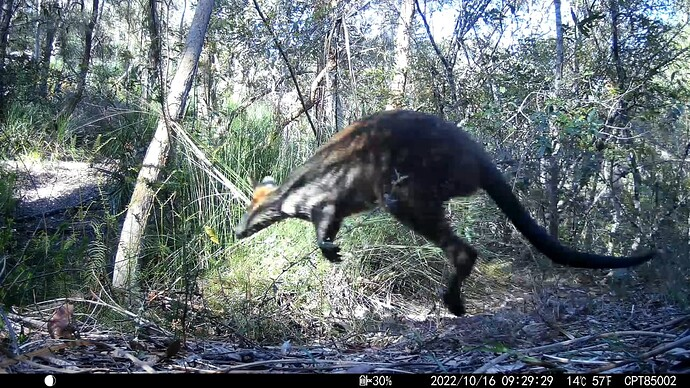

#### rOpenSci package or resource used*
[magick](https://github.com/ropensci/magick)

#### What did you do? 
Use R/magick in combination with ffmpeg and exiftool, to add geolocation and date-time metadata to images where metadata was not created by the camera.

#### URL or code snippet for your use case*
[Editing metadata in trail camera images using R, magick and exiftool](https://nsaunders.wordpress.com/2022/10/25/editing-metadata-in-trail-camera-images-using-r-magick-and-exiftool/)

#### Image

#### Sector
Other

#### Field(s) of application 
_ecology, citizen science_

