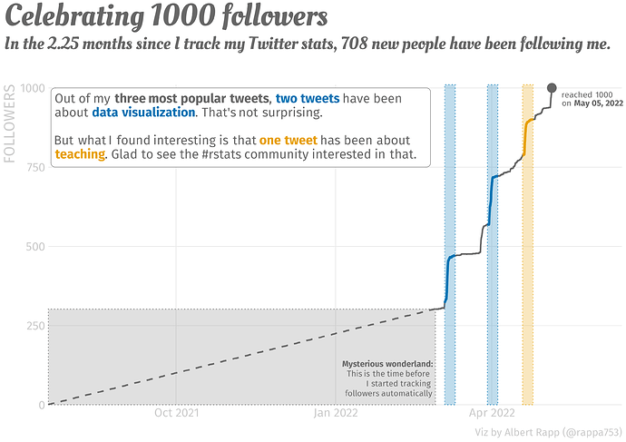

#### rOpenSci package or resource used*
[rtweet](https://github.com/ropensci/rtweet)

#### What did you do? 
In this blog post I give a quick tour of the rtweet and lubridate package. These help you to analyse your Twitter timeline. And they helped me to visualize my follower count as I reached 1000 followers this week. 

#### URL or code snippet for your use case*
Find my blog post at [albert-rapp.de](https://albert-rapp.de/post/2022-05-06-track-twitter-follower/).

#### Image
Here's a visual I created using the data I extracted the data from Twitter over time. It was a celebratory dataviz as I reached 1000 followers.

