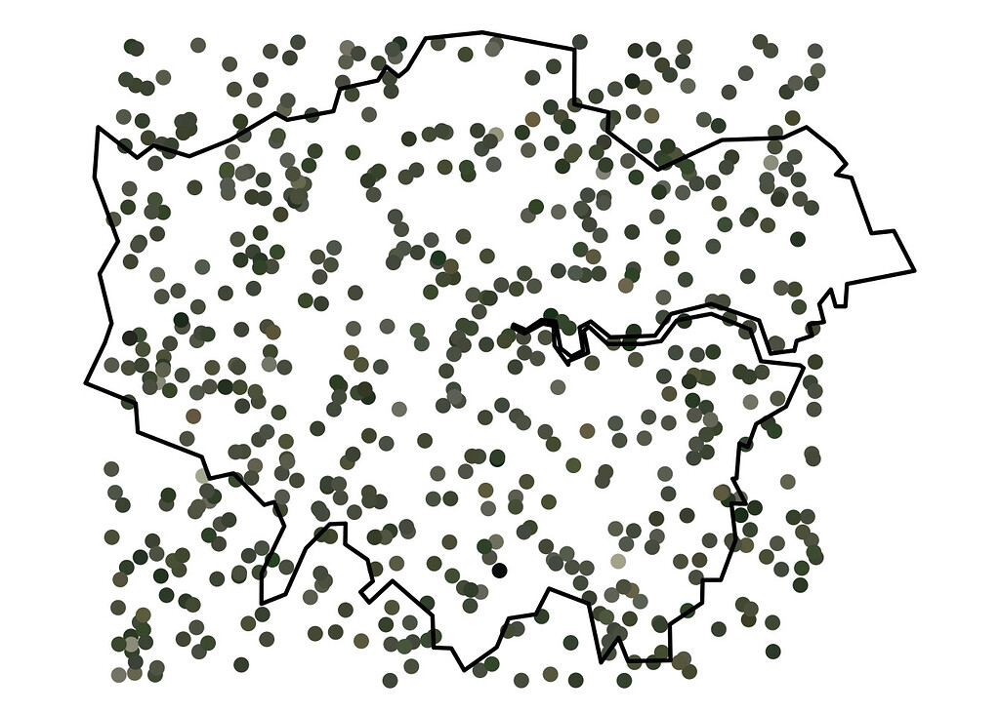

#### rOpenSci package or resource used

* [rtweet](https://docs.ropensci.org/rtweet/)
* [magick](https://docs.ropensci.org/magick/)

#### What did you do? 

I used [rtweet](https://docs.ropensci.org/rtweet/) to extract the images and body text (containing coordinates) from tweets by [@londonmapbot](https://twitter.com/londonmapbot), a bot that tweets satellite images of random parts of London (disclaimer: [I made the bot](https://www.rostrum.blog/2020/09/21/londonmapbot/)). Then I used [magick](https://docs.ropensci.org/magick/) to simplify each image to a single colour and extract its hex value. I used this information to create some visualisations of 'the colour of London'.

Functions used: `rtweet::get_timeline()`, `magick::image_read()`, `magick::image_crop()`, `magick::image_quantize()`, `magick::image_resize()` and `magick::image_data()`.

#### URL or code snippet for your use case

I wrote a blog post, [What colour is London?](https://www.rostrum.blog/2021/07/23/london-colour/), which contains the code and some visualisations.

#### Image

The image below shows 625 randomised points over a map of the outline of Greater London. Each point is a location sampled by the londonmapbot twitter bot, which tweeted a satellite image for those coordinates. I scraped the image and latitude-longitude data with {rwteet} and reduced the image to a representative colour with {magick}. The colours are largely different shades of browns, greys and greens.

The image below shows a 25 by 25 pixel grid, where each square is one of the locations sampled by londonmapbot that's been scraped with {rwteet} and reduced to a representative colour with {magick}. The pixels are ordered from top-left to bottom-right by luminosity.

#### Sector

Personal.

#### Field(s) of application 

Geospatial; image analysis; Twitter bots.

