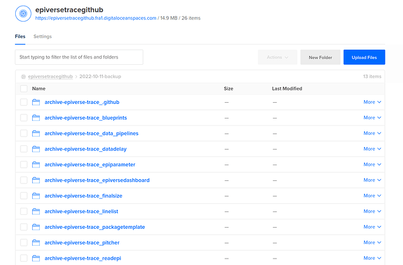

#### rOpenSci package or resource used*

- [gitcellar](https://docs.ropensci.org/gitcellar/)
- blog post: [Safeguards and Backups for GitHub Organizations](https://ropensci.org/blog/2022/03/22/safeguards-and-backups-for-github-organizations/)

#### What did you do? 

I replicated the back-up infrastructure from rOpenSci in our GitHub organisation: https://github.com/epiverse-trace.

Migration archives are created with gitcellar and are then uploaded to a DigitalOcean S3-compatible space with the `aws.s3` R package.

This is automated via GitHub Actions and runs on a weekly basis (each Saturday in the night).

For increased security, I have created a dedicated GitHub account, [`@epiverse-trace-bot`](https://github.com/epiverse-trace-bot), which hosts the repository with the automation and also provides a Personal Access Token (PAT) with minimal permissions. 

#### URL or code snippet for your use case*

https://github.com/epiverse-trace-bot/epiverse-trace-backup

#### Image

#### Sector

industry

#### Field(s) of application 

devops, epidemiology

