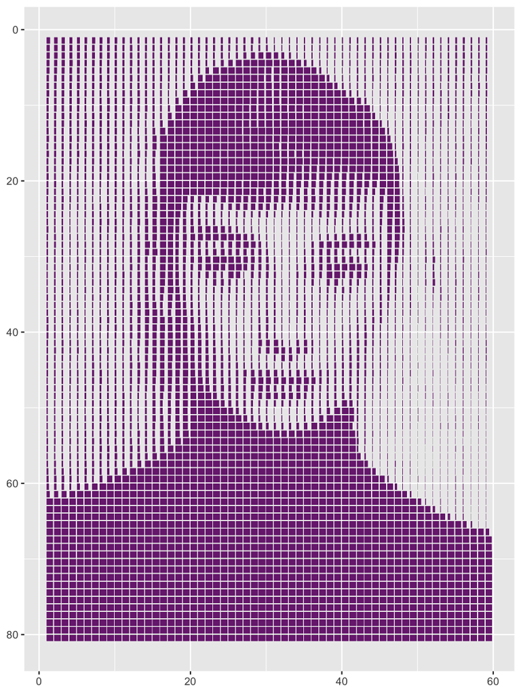

#### rOpenSci package or resource used*
magick

#### What did you do? 
I used magick to resize and convert an image to grayscale, and then to get the pixel values that represent their brightness. The values were used to make horizontal bars at the position of each pixel, with the width of the bar corresponding to reverse brightness (longer bars = brighter pixels).

#### URL or code snippet for your use case*
Code: https://github.com/gkaramanis/aRt/tree/master/split-bar

https://twitter.com/geokaramanis/status/1294141970445553664

#### Image
 

#### Field(s) of application 
Art

