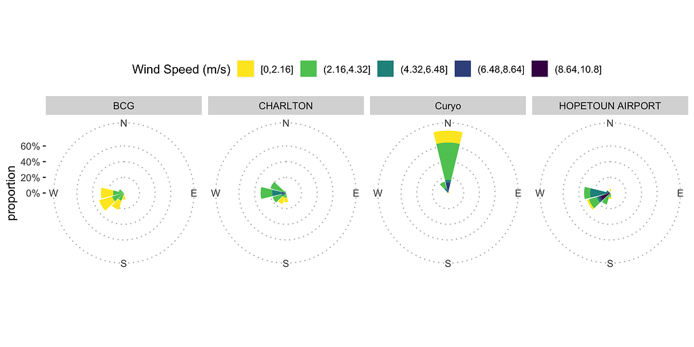

#### rOpenSci package or resource used

[bomrang](https://docs.ropensci.org/bomrang/), [clifro](https://docs.ropensci.org/clifro/)

#### What did you do? 

We had an issue with an on-site weather station where the wind-vane was not properly calibrated. So we opted to use BOM data to check wind directions during the rainfall events in which we were measuring fungal spore dispersal to make sure the wind was blowing roughly in the direction of our trap plants.

We used bomrang's `sweep_for_stations()` to identify stations within a given radius of a site where we had research plots to then download hourly weather data using the [stationaRy package](https://cran.r-project.org/package=stationaRy) (bomrang does not offer hourly weather data).

Wind roses were plotted using [clifro](https://docs.ropensci.org/clifro/) for the publication.

#### URL or code snippet for your use case

https://adamhsparks.github.io/ChickpeaAscoDispersal/articles/a06_Validate_Curyo_weather.html

#### Image

Note the "Curyo" windrose is not aligned with the others, this is what/why we were checking the BOM station data.

 

#### Sector

Academic

#### Field(s) of application 

botanical epidemiology

