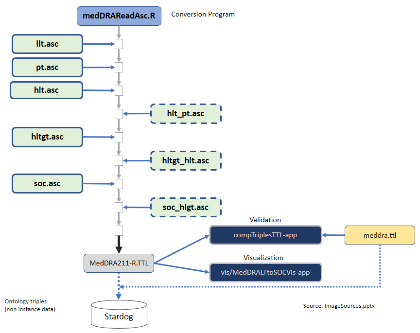

As part of the [PhUSE](https://www.phuse.eu/) project [Going Translational with Linked Data (GoTWLD)](https://github.com/phuse-org/CTDasRDF) we use the **rdflib** package to translate MedDRA terminology to Linked Data as RDF Triples. 

#### rOpenSci package or resource used*
[rdflib](https://github.com/ropensci/rdflib)

#### Use Case URL
[MedDRA Terminology Conversion to RDF](https://github.com/phuse-org/MedDRAasRDF/blob/37992ea830c835705481db3deb894246641e00dd/doc/MedDRAConversion.md)

#### Image
 

#### Sector
Pharmaceutical, Biotech, Medical/Healthcare

#### Field(s) of application 
Medical terminology coding including Adverse Events. Biomedical research, Pharmaceutical industry. 

#### What did you do? 
Used an ontology-based approach to convert the multiple hierarchical ASCii files to a unified Linked Data Graph representation. MedDRA terminology files are under license, but the conversion R scripts are freely available to anyone who wishes to convert their MedDRA coding to Linked Data. 

