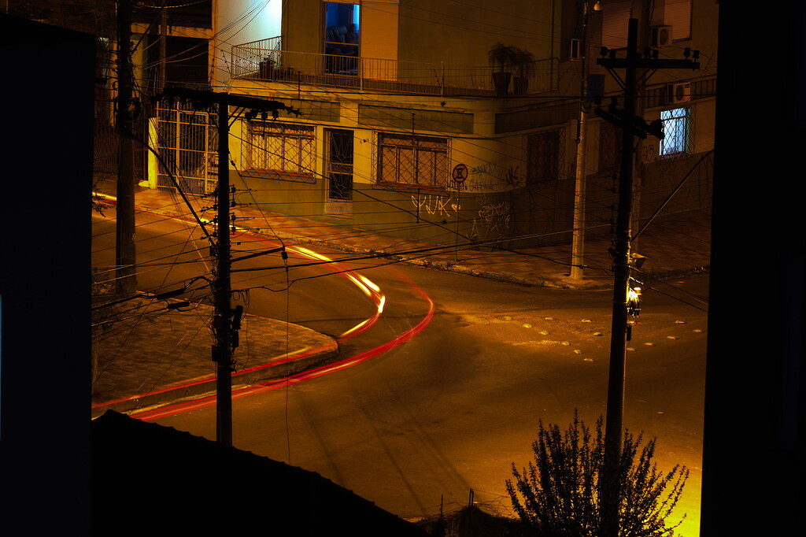

#### rOpenSci package or resource used*
[av](https://ropensci.org/packages/)

#### What did you do? 
I took a series of photos with my DSLR and a tripod using an intervalometer. 
- **Exposure Time:** 13s
- **Aperture Value:** F8
- **ISO:** 100

Then it was employed [#rstats](https://twitter.com/hashtag/rstats?src=hashtag_click) to create the time-lapse, without install another software. The [#av](https://twitter.com/hashtag/av?src=hashtag_click) package facilitates this work. This is my window view in Santa Maria-Brazil. Car lights painting the night during COVID-19 times.

#### URL or code snippet for your use case*
_Here you can find the code_
https://github.com/MauricioCely/time-lapse

#### Image
 

#### Sector
_non-profit / other_

#### Field(s) of application 
_e.g. photography, video and audio edition._

