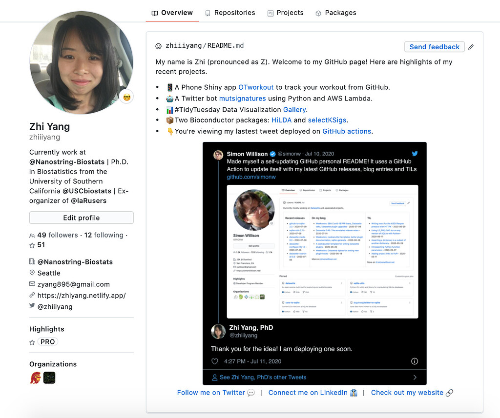

#### rOpenSci package or resource used*
[rtweet](https://github.com/ropensci/rtweet)

#### What did you do? 
After GitHub allows users to host their own README file on the profile page, people started to share many awesome README examples. Inspired by this [tweet](https://twitter.com/simonw/status/1281435464474324993) where Simon William used it to share his updates from blogs and commits, I created a README updating my latest tweet instead of having a static one by doing the following actions: 
1. Use rtweet to get my latest tweet.
2. Use tweetrmd and webshot2 to turn the tweet into a screenshot.
The entire process is deployed on GitHub using GitHub Actions [templates](https://github.com/malcolmbarrett/epibot) from my friend Malcolm Barrett. 

#### URL or code snippet for your use case*
https://github.com/zhiiiyang/zhiiiyang/blob/af2921e2fe01cd59cab9138907f8da37ceabcb1d/script.R

#### Image
 

#### Sector
academic

#### Field(s) of application 
Doesn't really fall into the typical fields. How about professional development? 

