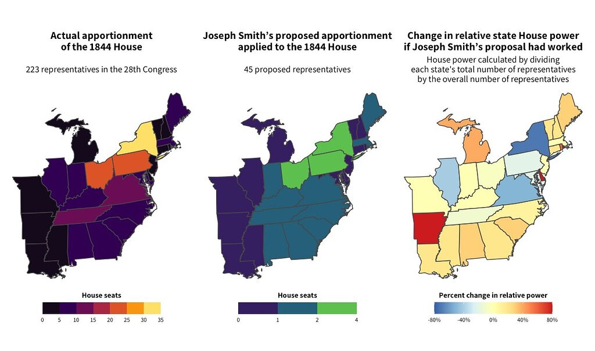

#### rOpenSci package or resource used

[USAboundaries](https://docs.ropensci.org/USAboundaries/)

#### What did you do?

While reading a book about a futile presidential candidacy in the 1800s by Mormon leader Joseph Smith, I noticed that he proposed radically reshaping congressional apportionment rules and only assigning one House Representative per 1 million residents per state. I wanted to see what that would have done to Congress in the 1840s, and I wanted to make a map showing how many representatives each state would get under the proposed rules.

Finding historical GIS data is hard, but I remembered that I had starred USAboundaries on GitHub a while ago, so I tracked it down and found it incredibly easy to get a shapefile for historical US maps. All you have to do is feed the `us_states()` function a date, and you get the corresponding borders as an [**sf**](https://r-spatial.github.io/sf/)-ready shapefile.

#### URL or code snippet for your use case

You can find the full code [at this gist](https://gist.github.com/andrewheiss/5f89847f617eb825a08de6b02a053188) (I use USAboundaries atarting at line 104), and I posted the finished maps and some more context in [this Twitter thread](https://twitter.com/andrewheiss/status/1443684142592536579).

#### Image

#### Sector

academic

#### Field(s) of application 

history, political science

