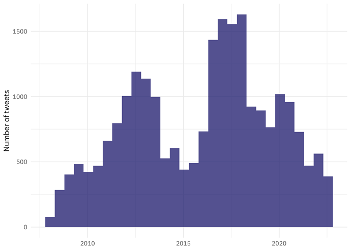

#### rOpenSci package or resource used
[rtweet](https://docs.ropensci.org/rtweet/)

#### What did you do? 
Worried about how a certain social media platform is going and want to start reducing your footprint there? If you are looking to remove yourself Twitter, you can entirely delete your account, but I’ve seen some folks say a better initial move may be to delete the content from your account (perhaps including followers and following), and then take your account private or deactivate it. This has the benefit of you keeping control of your username. In this blog post, I walked through how to use [rtweet](https://docs.ropensci.org/rtweet/) to automate some of these steps. I deleted about 25,000 tweets using this method!

#### URL or code snippet for your use case
Find my blog post at [juliasilge.com](https://juliasilge.com/blog/delete-tweets/)

#### Image
Before I started deleting my tweets, I made a visualization of how I have posted over time:

#### Mastodon handle
<https://fosstodon.org/@juliasilge>

