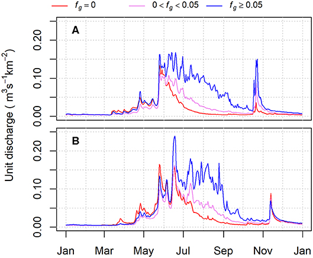

#### rOpenSci package or resource used*
[tidyhydat](https://github.com/ropensci/tidyhydat)

#### What did ~~you~~ they do? 
This study focused on the effects of glacier melt on streamflow in the Canadian portion of the Columbia River headwaters over the period 1977 to 2017. Between 1985 and 2013, glacier coverage decreased by up to 2% of catchment area for the 35 study catchments. The analyses suggest that glacier-melt  reductions have exacerbated a regional climate-driven trend to decreased August streamflow contributions from unglacierized areas.

#### URL or code snippet for your use case*
[ Detecting the Effects of Sustained Glacier Wastage on Streamflow in Variably Glacierized Catchments](https://www.frontiersin.org/articles/10.3389/feart.2020.00136/full)

#### Image

#### Sector
academic

#### Field(s) of application 
glaciology, hydrology

