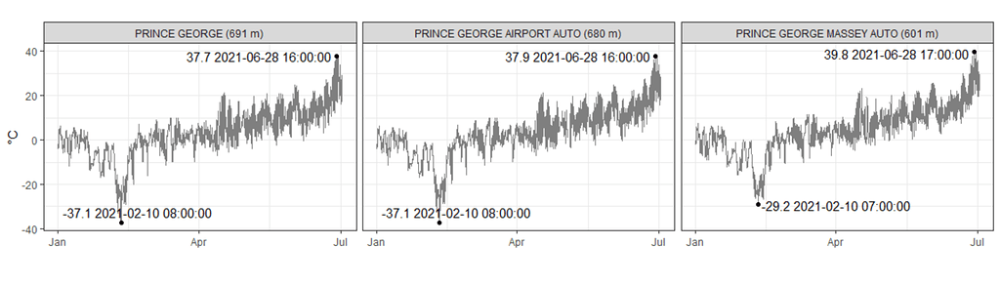

#### rOpenSci package or resource used*
[weathercan](https://docs.ropensci.org/weathercan)

Given the recent heatwave, I was curious about plotting up a timeseries of the local Environment Canada weather stations. For this, I used the `weathercan` package (https://github.com/ropensci/weathercan)

I'll walk through the few lines of code that it takes to search, download, and plot the data:

First, load a couple libraries:
```
library(dplyr)
library(ggplot2)
library(weathercan)
library(ggrepel)
```

Then, search the station IDs that have data for this calendar year and match my city name. 
```
stn <- stations_search("Prince George", interval = "hour", ends_earliest = "2021")
ids <- stn$station_id
```

Download the data using the station IDs. 
```
df <- weather_dl(station_ids = ids, start ="2021-01-01", end = "2021-07-01")
```

Optional: Add elevation to the station name.
```
df <- df %>% 
  mutate(station_name = paste0(station_name, " (", elev, " m)"))
```

Per station, calculate the min/max
```
df_minmax <- df %>% 
  group_by(station_name) %>% 
  filter(temp == min(temp, na.rm = T) | temp == max(temp, na.rm = T))
```

Plot it up! 
```
df %>% 
  ggplot(aes(time, temp)) + 
  geom_line(, color = "grey50") + 
  geom_point(data = df_minmax) +
  geom_text_repel(data = df_minmax, aes(label = paste(temp, time))) +
  labs(x = "", y = "°C") + 
  theme_bw() + 
  theme(aspect.ratio = 0.6) +
  facet_wrap(~station_name, ncol = 3)
```


