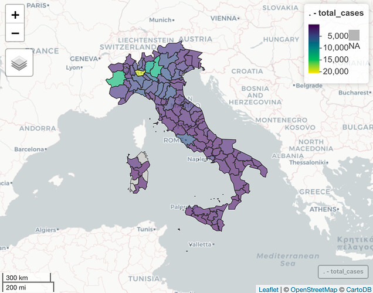

#### rOpenSci package or resource used

[`targets`](https://docs.ropensci.org/targets/), [`piggyback`](https://docs.ropensci.org/piggyback/)

#### What did you do? 

COVID-19 hospitalisations in Germany are released by date of positive test rather than by date of admission. This has some advantages when they are used as a tool for surveillance as these data are closer to the date of infection and so easier to link to underlying transmission dynamics and public health interventions. Unfortunately, however, when released in this way the latest data are right-censored meaning that final hospitalisations for a given day are initially underreported. This issue is often found in data sets used for the surveillance of infectious diseases and can lead to delayed or biased decision making. Fortunately, when data from a series of days is available we can estimate the level of censoring and provide estimates for the truncated hospitalisations adjusted for truncation with appropriate uncertainty. This is usually known as a nowcast.

In this work, we aim to evaluate a series of novel semi-parametric nowcasting model formulations in real-time and provide an example workflow to allow others to do similarly using German COVID-19 hospitalisations by date of positive test at the national level both overall and by age group, and at the state level. This project is part of a [wider collaboration](https://covid19nowcasthub.de) assessing a range of nowcasting methods whilst providing an ensemble nowcast of COVID-19 Hospital admissions in Germany by date of positive test.

All models are implemented using the [`epinowcast`](https://epiforecasts.io/epinowcast/) R package. The nowcasting and evaluation pipeline is implemented using the `targets` R package. All input data, interim data, and output data are available and should also be fully reproducible from the provided code. Please see the [resources section](https://github.com/epiforecasts/eval-germany-sp-nowcasting#documentation) for details. Further details on our methodology are included in our [paper](https://epiforecasts.io/eval-germany-sp-nowcasting/paper.pdf).

#### URL or code snippet for your use case

https://epiforecasts.io/eval-germany-sp-nowcasting/

#### Image

#### Sector

academic 

#### Field(s) of application 

epidemiology

