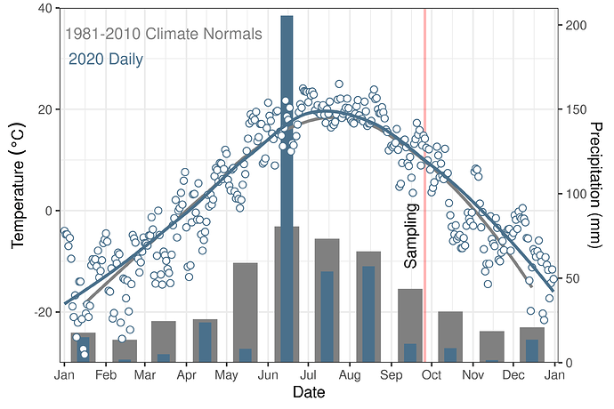

#### rOpenSci package or resource used*
[weathercan](https://docs.ropensci.org/weathercan/)

#### What did you do? 
I took my undergrad limnology class on a field trip to sample & characterize a local storm water retention pond in Brandon MB. Both weather and climate can provide important context when interpreting results. I used [Steffi's](https://twitter.com/steffilazerte/) [weathercan](https://docs.ropensci.org/weathercan/) package to get Environment and Climate Change Canada weather & climate data for [Brandon MB](https://twitter.com/CityBrandon/). I plotted up this data a few different ways and as a class we discussed how to best present this data. 

#### URL or code snippet for your use case*
https://github.com/alex-koiter/Weather-and-Climate-figures

#### Image
 

#### Sector
Academic

#### Field(s) of application 
Climate, Hydrology, Limnology, Geography, Environmental Science

