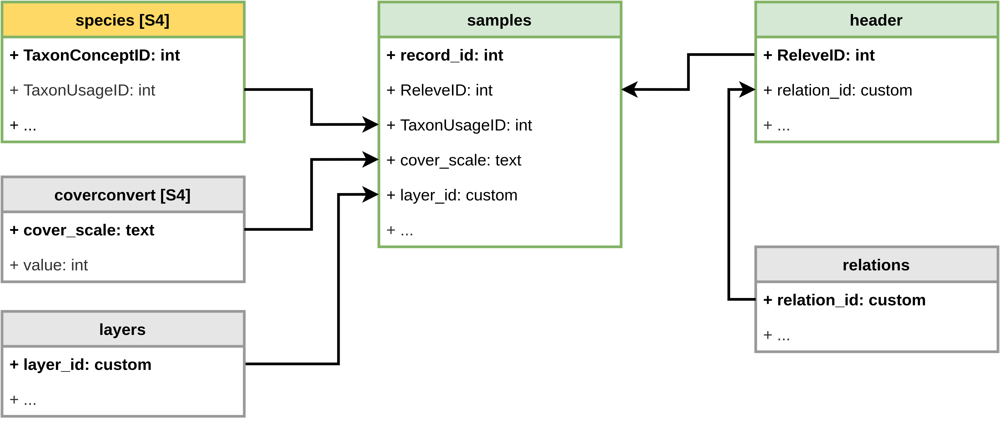

#### rOpenSci package or resource used*
[taxlist](https://docs.ropensci.org/taxlist/)

#### What did you do? 
Brief explanation about the use of the packages `taxlist` and `vegtable`, the second embedding the first.
Functions used to produce descriptive statistics and especially to calculate proportions of higher level taxonomic ranks in plot observations and to count taxa are also briefly introduced.

#### URL or code snippet for your use case*
https://kamapu.github.io/posts/2020-11-20-vegtablepress2/

#### Image
 

#### Sector
academic

#### Field(s) of application 
biodiversity, ecology, syntaxonomy

