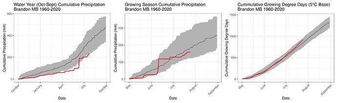

#### rOpenSci package or resource used*
[weathercan](https://docs.ropensci.org/weathercan/)

#### What did you do? 
Much of the Canadian prairies is experiencing drought conditions (https://agriculture.canada.ca/en/agriculture-and-environment/drought-watch-and-agroclimate/canadian-drought-monitor) resulting in significant wildfires and impacting agricultural production. I wanted to provide historical context for the current weather conditions. 

#### URL or code snippet for your use case*
https://github.com/alex-koiter/curiosity

#### Image

#### Sector
academic, agriculture

#### Field(s) of application 
Weather, climate, agriculture, disaster 

