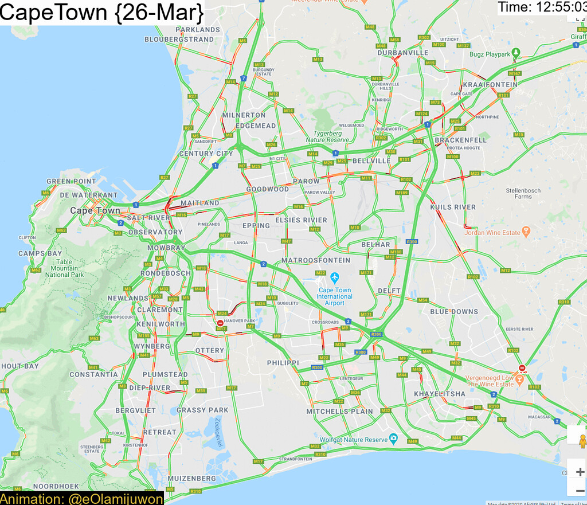

#### rOpenSci package or resource used
[magick](https://docs.ropensci.org/magick/)

#### URL or code snippet for your use case
https://e.olamijuwon.com/how-to-magickally-visualize-historical-google-maps-traffic-data/

#### Image
 

#### Sector
Other

#### Field(s) of application 
Social sciences

#### What did you do? 
I used {magick} in combination with {googleway} package to visualize historical road traffic in three major cities in South Africa. This exercise was motivated by the increased need to evaluate compliance with social distancing as many African countries enforce full/partial lock down in the wake of COVID-19. Unfortunately, Google Maps does not provide historical traffic data beyond traffic information on a typical (specified) day and time.
 
I took and saved a screenshot of GoogleMap traffic for each city every hour for 12 hours (starting at 7:55 - 19:55) in five days. I subsequently animated the saved screenshots using {magick} and saved the output as .gif. I believe that as lock down extends to more African countries, there may be an increasing need to visualize this compliance across cities and {magick} offers this flexibility perfectly. This activity is crucial to keep track of compliance and perhaps provide real-time updates about where the government may need to intervene.

