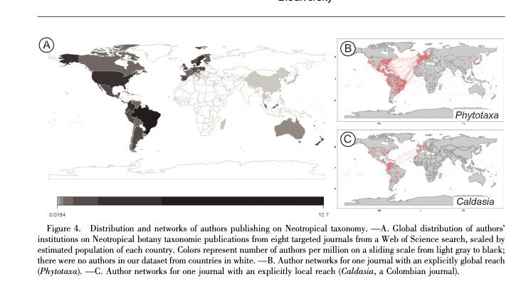

#### rOpenSci package or resource used*
[refsplitr](https://github.com/ropensci/refsplitr)

#### What did you do? 
To demonstrate the importance of taxonomy for the study of Neotropical biodiversity, the authors (1) showcase selected plant groups in which in-depth taxonomic understanding has facilitated evolutionary and ecological research and (2) map the teams of collaborating scientists.

#### URL or code snippet for your use case*
https://doi.org/10.3417/2020601

#### Image
 

#### Sector
Academic

#### Field(s) of application 
Botany, Ecology, Tropical Biology, Bibliometrics, Science of Science

