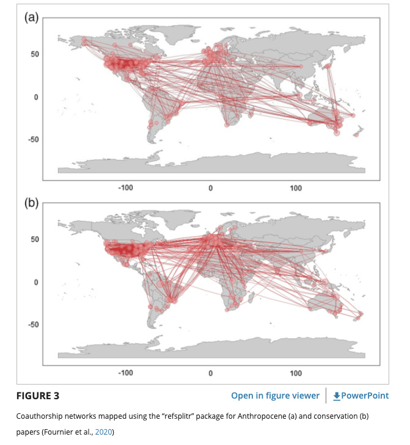

#### rOpenSci package or resource used*
Package [refsplitr](https://github.com/ropensci/refsplitr)

#### What did you do? 
The authors studied the location and patterns of collaboration of authors publishing research on the Anthropocene. 

#### URL or code snippet for your use case*
https://conbio.onlinelibrary.wiley.com/doi/10.1111/csp2.270 

#### Image
 

#### Sector
academic

#### Field(s) of application 
academic publishing, conservation biology, text analysis, scientometrics, bibliometrics, science of science

