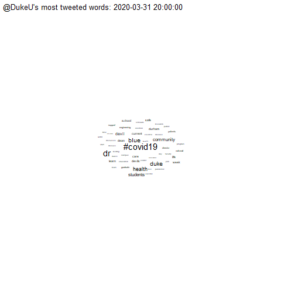

#### rOpenSci package or resource used

[`rtweet`](https://docs.ropensci.org/rtweet)

Also used: [`gganimate`](https://gganimate.com/), [`ggplot`](https://ggplot2.tidyverse.org/reference/ggplot.html), [`lubridate`](https://lubridate.tidyverse.org/). Code adapted from Julia Silge's and David Robinson's twitter case study in their book [Text Mining with R](https://www.tidytextmining.com/twitter.html) and a helpful [Stackoverflow](https://stackoverflow.com/questions/61132650/is-there-a-way-to-animate-a-word-cloud-in-r) answer by a user named [Edward](https://stackoverflow.com/users/7514527/edward) ;) 

#### What did you do? 
This was part of a final project for a course on Text Mining techniques. I analyzed the differences between three universities' main Twitter accounts: @DukeU, @NCState, @UNC. I took a year snapshot of tweets utilizing `rtweet` and tried to find similarities and differences of what they were talking about. Covid19 was one of the key similarities, which makes sense given the year was dominated by the pandemic. You can see the progression of most frequently tweeted terms (tokenized by unigrams) by the use of `gganimate` + `geom_text_wordcloud`. 

#### URL or code snippet for your use case
[https://sorayaworldwide.github.io/DukeUNCNCStateTweets.html](https://sorayaworldwide.github.io/DukeUNCNCStateTweets.html ) 

#### Image

#### Sector
Academic 

#### Field(s) of application 
Higher Education 

