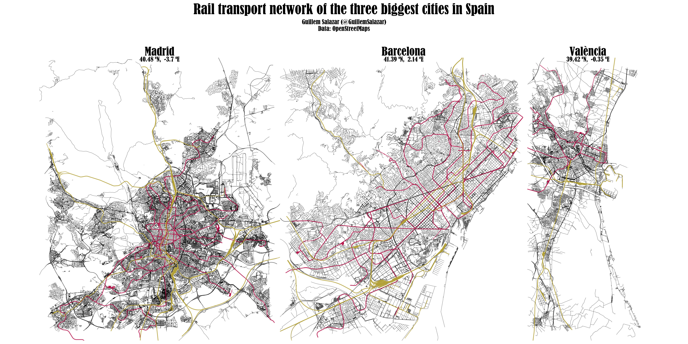

#### rOpenSci package or resource used*
_[osmdata](https://docs.ropensci.org/osmdata/)_

#### What did you do? 
_I combined several functions from the [osmdata](https://docs.ropensci.org/osmdata/)  package to download the vector data for the street grid and rail transport network of the three largest cities in Spain (Madrid, Barcelona and València) and try to produce a nice-looking plot of these cities._

#### URL or code snippet for your use case*
_https://github.com/GuillemSalazar/r_miscellanea/blob/72a477161e6fd5dfaad9661665cc9f38fa73060e/doc/1_osm.md_

#### Image
 

