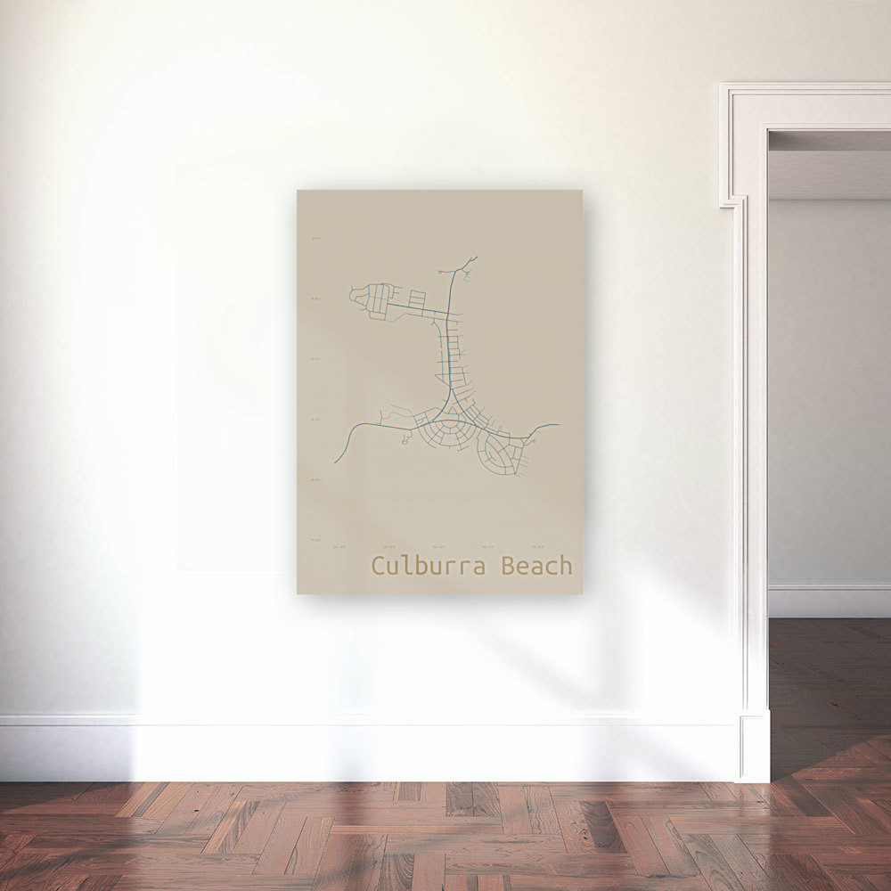

#### rOpenSci package or resource used*
[osmdata](https://docs.ropensci.org/osmdata)

#### URL or code snippet for your use case*
This [github repository](https://github.com/deanmarchiori/culburra) by Dean Marchiori

#### Image

#### What did you do? 
Dean Marchiori used the [`osmdata` package](https://docs.ropensci.org/osmdata/) to create a striking image which he printed and hung on a wall. His code to reproduce the image is contained with the [github repository](https://github.com/deanmarchiori/culburra) file [`culburra.Rmd`](https://github.com/deanmarchiori/culburra/blob/1dbf32edec17438b20e444a3b3722fd6c61feb5f/culburra.Rmd).

