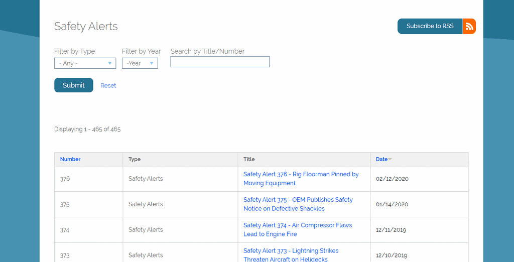

#### rOpenSci package or resource used*
[pdftools](https://github.com/ropensci/pdftools)


#### URL or code snippet for your use case*
```r
library(httr)  # will be use to make HTML GET and POST requests
library(rvest) # will be used to parse HTML
library(tidyverse) # data munge
library(pdftools) # parse pdf

# |- data ----
library(httr)  # will be use to make HTML GET and POST requests
library(rvest) # will be used to parse HTML
library(tidyverse) # data munge
library(pdftools) # parse pdf

# |- data ----
url <- "https://www.bsee.gov/guidance-and-regulations/guidance/safety-alerts-programs"

r <- GET(url)

raw_tbl <- r %>% 
  content() %>% 
  html_node("table") %>%
  html_table() %>% 
  as_tibble() %>% 
  janitor::clean_names()

raw_tbl

# |- munge ----
normalize_title <- function(title) {
  title %>% 
    tolower() %>% 
    str_replace_all("\\b\\s\\b", "\\-") %>% 
    str_remove_all("\\s")
}

clean_tbl <- raw_tbl %>% 
  mutate(norm_url = map_chr(title, normalize_title))

clean_tbl$norm_url[[1]]

base_url <- "https://www.bsee.gov/sites/bsee.gov/files/safety-alerts//"

ReadPDF <- function(base_url, pdf_url) {
  pdf_url <- glue::glue(base_url, {pdf_url}, ".pdf")
  
  print(pdf_url)
  
  # pdftools time!
  pdf_text(pdf_url)
}

SafeReadPDF <- possibly(ReadPDF, NA)

SafeReadPDF(base_url, clean_tbl$norm_url[[1]])
```

#### Image
 


#### Sector
Energy.


#### Field(s) of application 
Energy.


#### What did you do? 
Goal: improve safety performance by enabling quicker access to public safety alerts, and extract insights for decision-makers.

Extracted data from [pdftools](https://github.com/ropensci/pdftools) may then be analyzed downstream (e.g., [huggingface NLP](https://huggingface.co/)) and served via web app/API (e.g., [shiny](https://github.com/rstudio/shiny), [plumber](https://github.com/rstudio/plumber))


