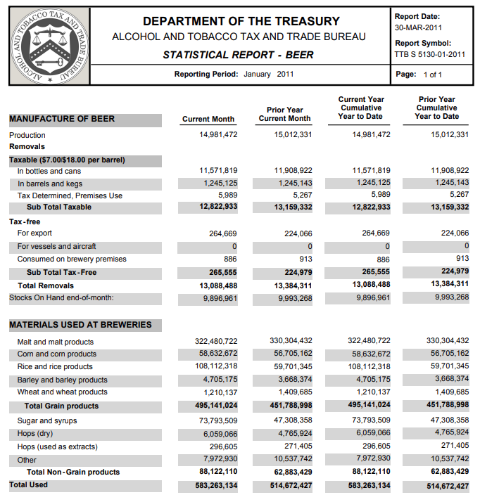

#### rOpenSci package or resource used*
[`pdftools`](https://github.com/ropensci/pdftools)

#### URL or code snippet for your use case*
* [Link to GitHub repo](https://github.com/jthomasmock/pdftools-guide)  
  * Has all the code and raw PDFs for users to test out themselves
* [Vignette/Webpage with example code run](https://jthomasmock.github.io/pdftools-guide/#scraping_complex_tables_from_pdfs_with_pdf_tools)

#### Image

Raw example of the PDF table from the TTB. Notice there are inconsistent spaces between the table columns.

#### Sector
Finance, econometrics

#### Field(s) of application 
Forecasting, finance, econometrics, but really could be used for anything!

#### What did you do? 

Goal: Read in non-trivially formatted tables from a PDF

Outcome:
* Read in PDF text/tables
* Split messy raw text into useful tabular format
* Combine into clean dataframes
* Apply across many similar PDFs

