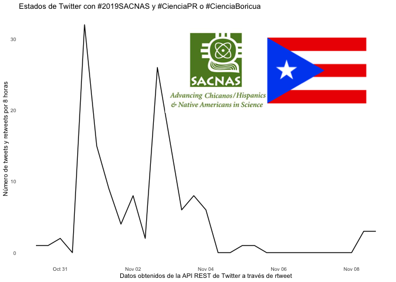

#### rOpenSci package or resource used

[rtweet](https://github.com/ropensci/rtweet), [magick](https://github.com/ropensci/magick)

#### What did you do? 

I like to use `rtweet` when I'm at conferences to look for impactful tweets and tweeters to follow or mute. I also enjoy using `magick` to add images to figures. 

After a conference, I happened to sit next to two conference attendee and I showed them my R code and my analysis. They encouraged me to write a blog post about how to use this tool, so I wrote this [blog post in English](https://www.raynamharris.com/blog/sacnas_rtweet/). Then I translated the human-readable parts of the code and published the [blog in Spanish](https://www.raynamharris.com/blog/sacnas_rtweet_es/). I shared both blogs [on Twitter](https://twitter.com/raynamharris/status/1192510904828432384) and they were well received.

#### URL or code snippet for your use case*

- [blog post in English](https://www.raynamharris.com/blog/sacnas_rtweet/)
- [gist in English](https://gist.github.com/raynamharris/289c08c8a428f201345cce44e1f5a8fb)
- [blog in Spanish](https://www.raynamharris.com/blog/sacnas_rtweet_es/)
- [gist in Spanish](https://gist.github.com/raynamharris/cf598a1cfdda4d5c150c99b8e9d87235)

#### Image

- [figure from Spanish blog post on on how to use rtweet](https://github.com/raynamharris/raynamharris.github.io/blob/ec8eaacf73025e9e638c0b1234c2bd4edff7e7d5/images/sacnas_ts_plot_es-1.png)

 

#### Sector

academic

#### Field(s) of application 

science

