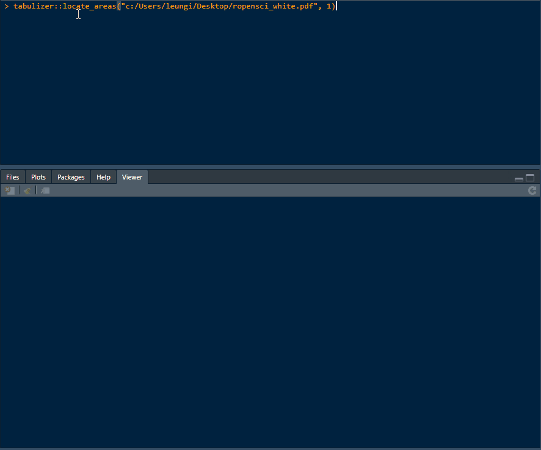

#### rOpenSci package or resource used*
 [tabulizer](https://github.com/ropensci/tabulizer)


#### URL or code snippet for your use case*
Goal: extract certain block of data from different sections of the .pdf

Strategy: use split-apply-combine approach via `locate_areas()` (to get box coordinates of sections of interest) and then `extract_tables()` to get the data with the section.

__`locate_areas()` demo__ 
 

__Code snippet__
```r
# |- fxn ----
# data munge function for map() later
CleanHeader <- function(tbl) {
  tbl %>%
    tidyr::pivot_longer(
      cols = -idx
    ) %>%
    dplyr::group_by(name) %>%
    dplyr::filter(value != "") %>%
    dplyr::summarise(value = paste0(value, collapse = ":")) %>%
    tidyr::separate(value, c("cat", "data"), sep = ":", extra = "merge") %>%
    dplyr::mutate_at(vars(data), stringr::str_remove, ":") %>% 
    dplyr::select(cat, data)
}

# |- data ----
file <- "./ropensci_white.pdf"

# get the box coordinates via interactive selection; this info is then used in extract_tables() area args
locate_areas(file, pages = 1)

# extract data
header_raw <- extract_tables(f, pages = 1,
                             area = list(c(74, 88, 128, 522)),
                             guess = FALSE)

# data munge; data/application specific
header_raw[[1]] %>% 
  tibble::as_tibble() %>% 
  janitor::remove_empty("cols") %>% 
  dplyr::mutate(idx = cumsum(stringr::str_detect(V1, "Section Marker"))) %>% 
  dlpyr::group_split(idx) %>% 
  purrr::map_dfr(CleanHeader) 
```

#### Image
Sample .pdf where coloured boxes represent sections of interest to extract data from.

See follow up post below for picture (new users may only post 1 image/post :sweat_smile:) 

#### Sector
Energy.


#### Field(s) of application 
Energy.


#### What did you do? 
Use {tabulizer} from rOpenSci to extract data of interest from .pdf to save time and avoid data quality issue that may be introduced if it was done manually.


