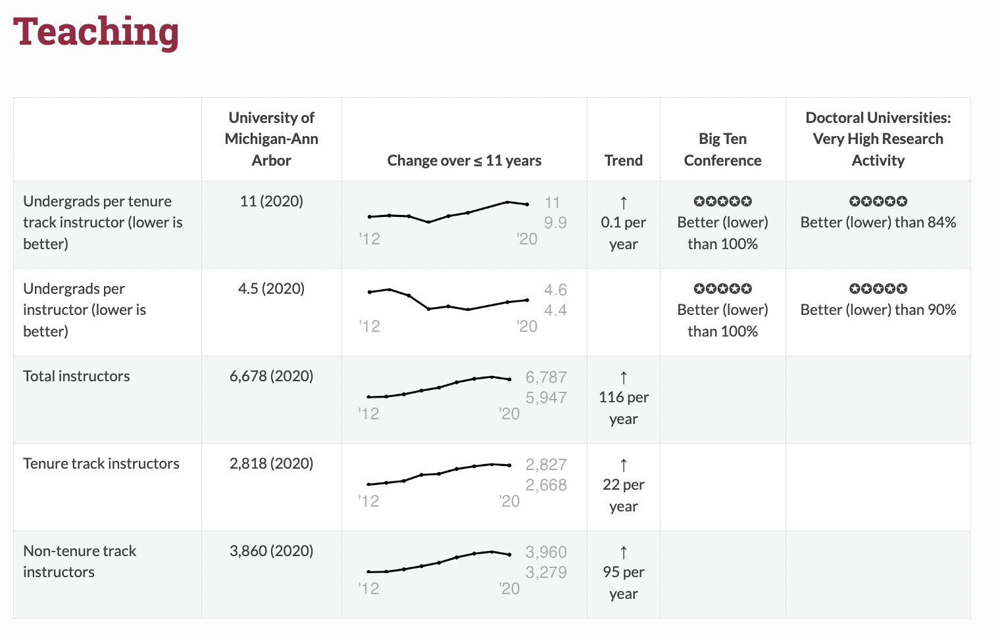

#### rOpenSci package or resource used

https://books.ropensci.org/targets/ for the `targets` and `tarchetypes` packages

#### What did you do? 
I made a 13,424 page website, <https://collegetables.info/>, to compare US colleges; it tracks things like graduation rates and finances over time, as well as distributions of degrees by fields. It was featured in the *New York Times* ([gift link](https://www.nytimes.com/2023/04/15/your-money/college-cost-data-tools.html?unlocked_article_code=hN2IwBdFONp5CmgbxhKM-HVUid0P2EEoomfIcGniJ6EcogeoxOwoimKabx7gynOb0f6-QxIpIELuqqT35rk-nLmDMZMDAljFtcY-YQBvNGWVgLCKOj7omvSxUjcQbXnG4B8H67gTFWQA8USo6Y3Xs5RWuXjQ8Chp2WchftGv-k9oTf7m0nPvki2JmPoQiawOquJTtiwFG9lxEX5-vSzJIvBPu5Gl_-jhW5wisUpTZCQWfzr9Ar56ix7q2rQ2B4qqyQxpPWqow2gJ_D0eF5c4PhAzh-QksTofGv9rUG0SJmgnDhUkCcF361B0kpugBjccqwqYBuaTbSFMqBowPacjapogDFA&giftCopy=1_CurrentCopy&smid=url-share)).

#### URL or code snippet for your use case*
<https://brianomeara.info/posts/collegetables/>

#### Image

#### Sector
academic

#### Field(s) of application 
Selecting colleges for enrollment or employment, comparison of institutions, comparison of fields

#### Mastodon handle 
@omearabrian@mastodon.social

