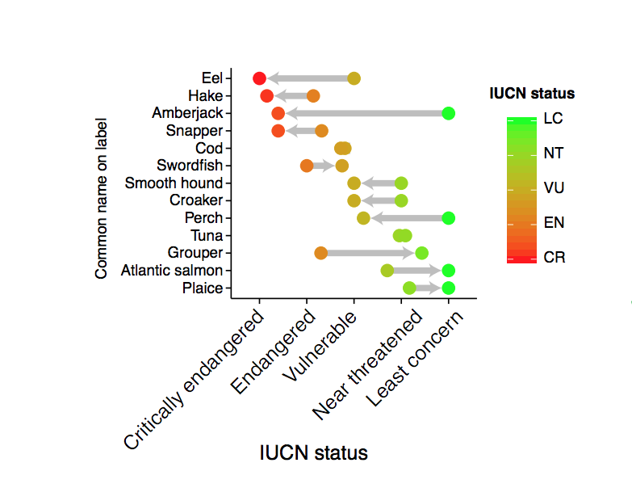

This use case was presented by [Margaret Siple](http://www.margaretsiple.com/) as part of a [Community Call on Research Applications of rOpenSci Taxonomy and Biodiversity Tools](https://ropensci.org/commcalls/2019-03-27/)

#### Package used
[taxize](https://github.com/ropensci/taxize)

#### Links to use case
- [Code example](https://mcsiple.github.io/rOpenSciExample.html): Given genus names, retrieve family names and Given a list of species names, get their IUCN status
- [Paper](https://onlinelibrary.wiley.com/doi/full/10.1111/conl.12328): Financial and Ecological Implications of Global Seafood Mislabeling

#### Image
 

