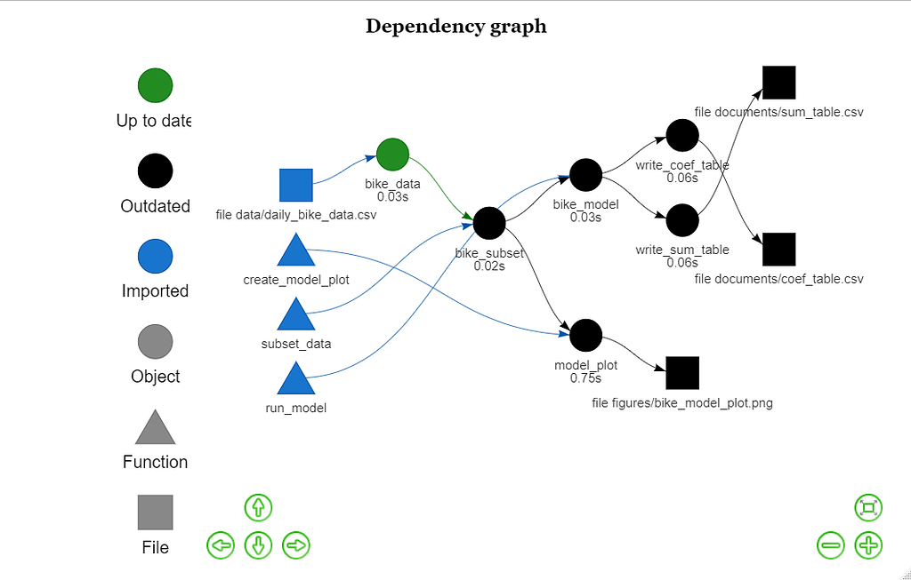

#### rOpenSci package or resource used*
[`drake`](https://github.com/ropensci/drake)

#### What did you do?
In fall 2020 the [Center for Environmental Research, Education and Outreach](https://cereo.wsu.edu/) at Washington State University hosted a workshop covering reproducible research techniques in R for graduate students. We wanted to cover `drake` workflows as one day of the workshop to show the students what R-specific options there are for managing workflows. We expected that workflow management and to some extent R functions would be unfamiliar topics to many students, so the workshop day included discussion of why one would use workflow management software and some basic examples of building realistic functions. At the time that we ran the workshop I wasn't aware of [`targets`](https://github.com/ropensci/targets), so in the future we may repurpose this example using that package instead.

#### URL or code snippet for your use case*
+ Blog-style post that combines the content from presentation slides with a walkthrough document [here](https://mbrousil.github.io/drake_wkshp).
+ Example project repository [here](https://github.com/mbrousil/example_drake_project)

#### Image
 

#### Sector
Academic

#### Field(s) of application
General use

