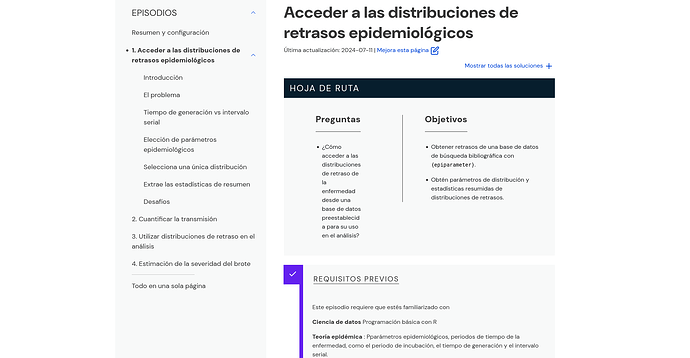

#### rOpenSci package or resource used

The [babeldown R package](https://docs.ropensci.org/babeldown/).

#### What did you do? 

We have training materials built with the Carpentries [workbench](https://carpentries.github.io/workbench/) and wanted to translate them in Spanish for an upcoming training with a Peruvian audience.

Since lessons in the workbench are markdown and Rmarkdown files, babeldown appeared as a good candidates to speed up the creation of a first draft.

Output files were placed in the `locale/es/episodes/`, following the convention started by @joelnitta in [dovetail](https://github.com/joelnitta/dovetail).

The ML-generated translations, after a first rough automated post-processing (see below), were reviewed by native Spanish speakers: https://github.com/epiverse-trace/tutorials-middle/pull/95

#### URL or code snippet for your use case

https://github.com/epiverse-trace/tutorials-middle/pull/95

#### Image

#### Sector

academic, non-profit, government

#### Field(s) of application 

epidemiology, pedagogy

#### Mastodon profile link 

https://mastodon.social/@grusonh

