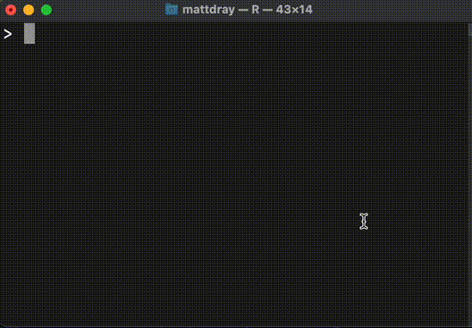

#### rOpenSci package or resource used

The [opencv](https://docs.ropensci.org/opencv/) package.

#### What did you do? 

Wrote a demo function that only returns an answer when you present a QR code to your device's camera that encodes the correct ‘password’.


#### URL or code snippet for your use case

There's a [blog post](https://www.rostrum.blog/posts/2023-11-01-qr-enabled-fn/) and [Mastodon post](https://fosstodon.org/@mattdray/111332716385219584).

The function:

``` r
add_one <- function(n) {
  
  string_in <- opencv::qr_scanner()
  password <- RCurl::base64Decode("b3BlbmN2IHNlc2FtZSE=")
  
  if (string_in == password) {
    cat("🔑 Correct password!\n")
    n + 1
  } else {
    stop("Wrong password!", call. = FALSE)
  }
  
}
```

Running the function will cause `opencv::qr_scanner()` to open your device's camera. QR codes presented to the camera will be decoded. If the correct password is encoded by the QR code, then the function will print a result (so `add_one(1)` will return `2`). (Note that the password is exposed in the body of the function, so I've 'hidden' it behind base64 encoding.)


#### Image




#### Sector

Other.


#### Field(s) of application 

* Fun. 
* The opportunity to generate multi-factor authentication via QR code, as [pointed out](https://fosstodon.org/@jeroenooms/111334491799517085) by @jeroenooms.


#### ~~Twitter~~ Mastodon handle

`@mattdray@fosstodon.org`

