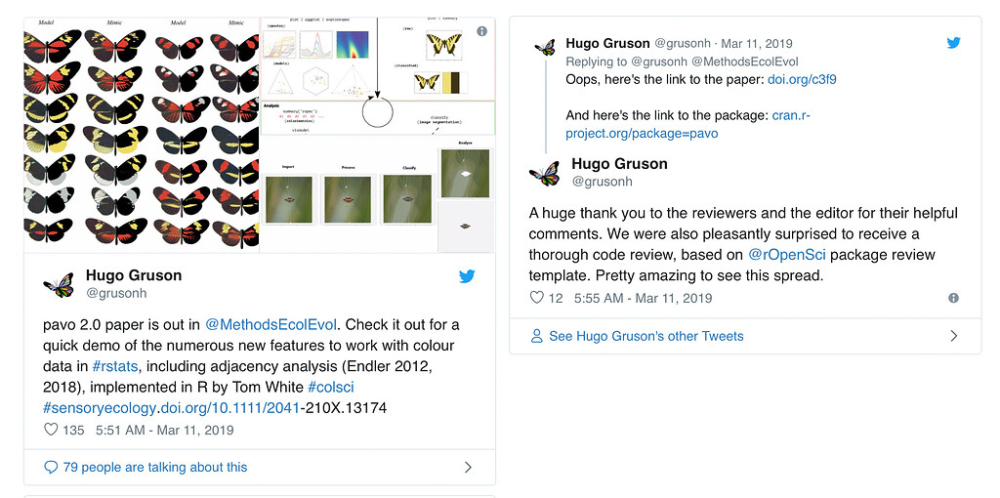

#### Package or resource used
rOpenSci [package development guide book](https://devguide.ropensci.org/)

#### URL or code snippet for your use case
https://ropensci.org/blog/2019/04/18/wild-standards/

#### Image
 

#### Sector
academic

#### Field(s) of application 
academic manuscript review

#### What did you do? 
Quoted from Hao Ye @hye in the [blog post](https://ropensci.org/blog/2019/04/18/wild-standards/): 
>When I was asked to review the code for the pavo 2.0 manuscript[1](https://ropensci.org/blog/2019/04/18/wild-standards/#fn:1), I had an initial moment of panic – I had no experience doing formal code review. Luckily, I knew that rOpenSci had a set of reviewing guidelines, and that a few MEE Applications papers had used them. The same guidelines are also used by the [Journal of Open Source Software](https://joss.theoj.org/) (JOSS). Although this submission wasn’t flagged for rOpenSci review, I didn’t see a conflict with using their guidelines for my task.

> The checklist helped me to organise my review. I started with the basic package review template, and then focused on a detailed look at the primary vignette (which is where I expect most users start). The rOpenSci guidelines encourage the use of some automated tools, like  `goodpractice`  to facilitate reviewing. The hardest part was providing suggestions to address what the  `goodpractice::gp()`  function flagged as complex or redundant code. The remainder of the review went pretty smoothly. I’m a fan of task checklists, so I’m glad that the authors found my comments useful. Hopefully the changes will help with the future maintenance of the package."

